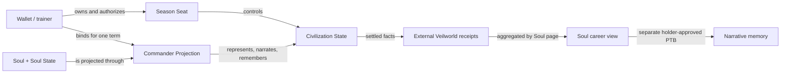

# The Role of Soul

## Canonical definition

In Veilworld, a Soul is the persistent digital life that repeatedly enters temporary worlds and takes on roles inside them.

It has three simultaneous product functions:

1. **Character:** a recognizable identity with a visual projection, personality, temperament, and voice.
2. **Relationship node:** a stable subject that can build trust, rivalry, mentorship, and affiliation across seasons.
3. **Career archive:** the holder of bounded, verifiable records about what happened in prior worlds.

The avatar is one expression of the Soul, not the Soul's entire role. The seasonal commander is one role performed by the Soul, not a permanent class. The empire belongs to the player's season seat, not to the Soul.

The shortest system definition is:

> Soul is the actor. Commander Projection is the role. Civilization State is the seasonal world state.

## Why this separation matters

If the Soul is only a profile picture, it adds branding but not gameplay meaning. If it is the empire, transfer semantics become unsafe: selling a Soul would appear to sell planets, secret coordinates, live fleets, and rank. If it is a traditional RPG hero, persistent stats create pay-to-win pressure and make seasonal resets dishonest.

The proposed model preserves identity while resetting power.



## Four layers of identity

### Wallet or trainer

The wallet signs transactions and may hold the relevant ownership or control capabilities. It is an account boundary, not the fictional protagonist.

### Season Seat

`SeasonSeat` is the competitive identity for one season and league. It controls the civilization and is the unit for ranking, rate limits, anti-sybil rules, sponsorship, and sanctions.

Suggested fields:

```text
season_id
seat_id
controller
league
status
joined_at
score
public_season_alias
season_build_hash
```

### Commander Projection

`CommanderProjection` is a term-limited binding between a real Soul and a Season Seat. It freezes the public representation and authorization facts needed by the game without copying or owning the Soul.

Suggested fields:

```text
season_id
seat_id
soul_id
soul_state_id
owner_at_bind
ownership_epoch_at_bind
visual_snapshot_hash
outcome_policy_hash
started_at
ended_at
status
```

Recommended statuses:

- `Active`
- `Retired`
- `DetachedByTransfer`
- `Finalized`

The projection is not a new tradable identity. It is a historical role record and validation surface.

### Civilization State

`CivilizationState` contains only public or committed temporary competitive state: planets, energy, resources, fleets, upgrades, and score. It is reset or frozen at season settlement.

`ClientSecretState` is a separate, encrypted, local-only concept containing coordinate preimages, salts, search caches, private annotations, and any alliance secrets. It is never owned by a Soul or represented as an onchain Civilization field.

## Binding a Soul to a season

A formal season entry should:

1. Validate the canonical `SoulState` ID, Soul ID, supported interface version, current owner, current `ownership_epoch`, and `!is_listed`.
2. Read and store the current `ownership_epoch`.
3. Claim a unique `SoulSeasonSlot` keyed by `(season_id, soul_id)` so the same Soul cannot command multiple ranked seats in one season.
4. Consume the seat's one ranked commander slot so a Season Seat cannot rotate through multiple Souls.
5. Freeze approved visual and outcome-policy hashes in the Commander Projection.
6. Freeze the equal-budget seasonal doctrine/build separately in the Season Seat.
7. Create the Commander Projection and connect it to the fresh Season Seat.

Both slots remain consumed for the entire ranked season, including after retirement or transfer. A buyer of a mid-season Soul cannot deploy it in another ranked seat until the next season. The marketplace and confirmation UI must disclose this restriction before transfer.

The game must validate the real `SoulState`; it must not trust only a copied owner address or client-supplied Soul metadata.

An account may complete the tutorial with a game-local `StarterCommander`. Before entering a formal ranked season, it either selects an owned Soul or completes an assisted Soul creation flow covering Personal Kiosk setup, Soul minting, initial content, gas sponsorship, and per-person abuse controls. Gas sponsorship alone does not create a Soul, and `StarterCommander` is not presented as a Soul.

## Authorization model

Strategic control and Soul attribution are distinct:

- In the ranked Alpha, ordinary human actions validate `ctx.sender()` against the fixed controller on the Season Seat.
- A Soul-attributed action additionally validates the complete live predicate below and updates a bounded onchain attribution accumulator.
- `WorldCommandCap`, introduced only for the Open Agent League, grants narrowly scoped game commands with expiry and rate limits.
- Existing general-purpose `SoulGrant` permissions must not silently become game-control permissions.

A future recovery or delegation design may introduce a separate `EmpireControlCap`. It remains an empire authorization surface, never a Soul ownership right.

This separation keeps a compromised integration, marketplace, or narrative agent from inheriting control over a live civilization.

The live predicate is:

```text
projection.status == Active
state_id == projection.soul_state_id
soul_id(state) == projection.soul_id
current_owner(state) == projection.owner_at_bind
ownership_epoch(state) == projection.ownership_epoch_at_bind
```

Pure strategic actions may update only Seat/Civilization state and need not claim Soul attribution. Every call that updates Soul-linked counters, achievement bits, relationship facts, or Soul-stamped events must pass the canonical `&SoulState` and evaluate this predicate at execution time. `DetachedByTransfer` is only a cached/materialized status; logical invalidation never waits for it.

For a future agent action, the same predicate applies, while `ctx.sender()` matches the `WorldCommandCap.grantee` and the cap records the bound Seat controller, control generation, action mask, expiry, and rate/spend limits. The current holder and ownership epoch must still match the projection.

## Transfer during a season

The protocol must make this case boring and deterministic.

When a bound Soul changes owner:

1. A supported Soulidity Market purchase rotates the canonical owner and increments `ownership_epoch`; listing alone does neither.
2. The Commander Projection's epoch snapshot no longer matches.
3. Soul-attributed actions fail immediately, even if the projection has not yet been physically updated.
4. The civilization remains controlled by its Season Seat.
5. In ranked play, the seat operates under a neutral commander presentation for the rest of the season; it cannot bind another Soul.
6. The buyer receives the Soul and its public history, but receives no planets, fleets, coordinates, score, Season Seat, or empire capability.

The game may lazily materialize `DetachedByTransfer` on the next interaction. Logical invalidation must not depend on an indexer, keeper, or cron job. The independent Veilworld UI must warn that a bound Soul may still be listed under the current core protocol and explain the ranked-season restriction before purchase.

The Season Seat's public alias, action history, promises, sanctions, and ranking identity remain unchanged after detachment. Switching to a neutral commander cannot erase accountability.

Unranked social worlds may experiment with rebinding, but their receipts must be clearly separated from ranked career records. A future high-stakes ranked season may use a narrowly scoped `RuntimeLock`, but an external Veilworld object cannot block the existing Soul marketplace. A real lock requires an explicit Soulidity `TransferPolicy<Soul>`/market extension, deterministic expiry, recovery path, and UI consent. Runtime lock support does not exist in the current core protocol. The Alpha therefore uses epoch invalidation.

## Persistent progression without permanent power

### What persists

- Verified season participation.
- Eligible score-band, achievement, or beacon-winner recognition under the receipt rules below.
- Major actions such as discovery, rescue, betrayal, beacon contribution, or last stand.
- Relationships and affiliations, with clear provenance.
- Historical doctrine choices and visual projections, without carrying their functional effects forward.
- Player-authored or AI-assisted narrative accepted by the holder.
- Cosmetic unlock eligibility.

### What resets

- Planets and territory.
- Energy and resources.
- Fleets and arrival queues.
- Technologies with strategic effects.
- Map knowledge in the canonical game state.
- Score and league position.
- Any numerical combat or economy bonus.

### What must never create ranked advantage

- Soul rarity, market price, or age.
- Number of previous seasons.
- Public popularity or follower count.
- Editable personality or skill files.
- Cosmetic traits.
- Purchased chronicles, which must never unlock protocol privileges, matchmaking advantages, or ranked modifiers.

Long-term progression should increase expressive range, social context, and narrative depth—not win probability.

## Season records and memory

A completed season produces a compact, deterministic `VeilworldSeatReceipt`. It records the civilization's result regardless of whether the player chooses to display or narrate it. A separate frozen `VeilworldSoulSegmentReceipt` externally associates only facts accumulated while one Soul binding and ownership epoch were valid. These are issued by the Veilworld package and aggregated by a Soul career UI; they are not fields inside the current `SoulState` and are not independently tradable NFTs.

Suggested record fields:

```text
record_schema_version
issuer_package_id
season_id
seat_id
projection_id
soul_id
soul_state_id
owner_at_bind
ownership_epoch_at_bind
bound_at
last_valid_attribution_at
closed_at
termination_reason
segment_action_start
segment_action_end
league
eligible_achievement_bits
attribution_accumulator
attribution_leaf_schema_version
seat_result_ref
commanded_through_settlement
rules_hash
circuit_config_id
engine_package_id
settlement_tx
```

Final score and objective result belong canonically to the Season Seat. A Soul receives score-band or beacon-winner recognition only if its original binding remains valid through settlement and satisfies the published minimum participation rule. A detached Soul receives a closed segment stating when it was bound, the last valid attribution, when the segment was materialized as closed, and which eligible facts had already been accumulated. Merely referencing a successful Seat does not assert that the Soul earned its final result.

If a Soul changes hands during a season, no later action can enter the old accumulator because the live predicate fails in the chain-defined order. Move cannot query historical events to discover the transfer time later, so `closed_at` records materialization time rather than pretending to be the purchase time. The buyer cannot create a second ranked segment with the same Soul during the season.

Each valid attributed action increments a projection-local nonce and updates a rolling, domain-separated accumulator over a fixed leaf encoding. The corresponding leaves are emitted in canonical order and remain retrievable from Sui checkpoints. Settlement reads this onchain accumulator; an indexer does not invent the root after the fact.

The current holder may review a derived narrative and then submit a separate Soulidity owner transaction that stores the referenced content through the supported memory path. Veilworld cannot automatically modify `SoulState` or claim that the receipt was written into a core Outcome slot. Approval controls the narrative transaction, not the existence of external factual receipts. The narrative is interpretation; the receipt is evidence. UIs must distinguish them.

Veilworld should offer only public-safe prose for transferable Soul memory. Coordinates, salts, map notes, alliance secrets, and live strategic plans stay in `ClientSecretState` and are categorically excluded. Any memory surface must explain what a future Soul owner could read under the active Soulidity memory policy before the holder accepts it.

## Visual projection and rights

Season 0 uses a public `image_url` or an explicitly licensed immutable projection. The snapshot records the artifact reference, content version, hash, rights/policy version, and a permanent fallback piece. A hash proves identity, not availability or commercial permission. Private Active Sprite access and an `ASSETS` read grant do not by themselves authorize animation, cropping, recoloring, commercial display, or continued use after the ownership epoch changes.

Historical replay may show only the material covered by the captured rights policy; otherwise it uses the fallback piece and keeps the factual attribution.

## Product expression

The Soul should appear in four places:

- **Entry:** choosing who enters this universe, then choosing an equal-budget seasonal doctrine for the Seat.
- **Command:** portrait, voice, ritual, relationship context, and decision framing.
- **Turning points:** signed moments when the Soul's character becomes legible through action.
- **Aftermath:** a season chronicle showing what the Soul witnessed, chose, and became known for.

It should not appear as a constant modal, a stat multiplier, or a requirement for every low-level transaction. The strategic map remains the primary play surface.

## Relationship design

Relationships are strongest when based on reciprocal or contested facts. Useful primitives include:

- Mutual alliance acknowledgment.
- One-sided promise followed by completion or breach.
- Reinforcement and rescue receipts.
- Shared beacon participation.
- Repeated conflict between the same Souls.
- Mentor participation in a new player's first season.

Every relationship receipt includes season, Soul ownership epoch, and Seat provenance. A transfer marker must be visible in relationship and career views. Character lore is not an operator trust score: league sanctions, anti-cheat state, eligibility, and controller accountability remain attached to the Season Seat and relevant controller identity rather than becoming purchasable with a Soul.

Do not infer intimate or moral traits from ordinary combat telemetry. The game may say “these Souls fought in three universes”; it should not automatically say “this Soul is cruel.” Narrative claims require transparent rules and, where subjective, holder acceptance.

## Design test

For every proposed Soul feature, ask:

1. Does it make the Soul more recognizable or its history more meaningful?
2. Can it be verified or clearly labeled as interpretation?
3. Does it avoid transferring hidden seasonal state?
4. Does it avoid permanent ranked power?
5. Does it remain understandable when the Soul changes owner?

If any answer is no, the feature should not ship in ranked play.
