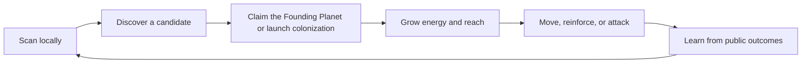

# Game Design

## Design goal

Create a strategy game where private knowledge, timing, and relationships matter more than transaction speed or asset wealth. A complete season must tell a story with a beginning, escalation, public climax, and deterministic end.

## Core loop



Each step should create a meaningful choice:

- **Scan:** spend local time and attention to improve private knowledge.
- **Establish:** use the one-time home claim or send a fleet that creates and contests a neutral planet.
- **Grow:** decide between local safety, expansion, and preparation.
- **Move:** reveal direction indirectly through source and destination commitments and arrival timing.
- **Interact:** fight, reinforce, coordinate, bluff, or withhold.
- **Learn:** update a private map using only information legitimately observed.

A newly enrolled ranked Civilization begins `AwaitingHome` and controls no Planet. Its first finalized `claim_home` creates exactly one Seat-owned Founding Planet and activates the Civilization. Later discovery still grants knowledge rather than ownership; expansion requires a proof-bound arrival.

## Season structure

### Tutorial universe

- Isolated and resettable.
- No Soul required.
- Teaches map privacy, proof generation, claiming, movement, arrival, and settlement.
- Target completion time: 8–12 minutes.
- Uses a deterministic local simulation with clearly labeled simulated transaction/finality states and a denser, smaller tutorial universe. It requires no wallet or onchain signer. If a later tutorial becomes onchain or uses a simpler circuit, that is a separately specified authority/domain, verifying key, privacy model, and non-ranked state.
- Uses a game-local tutorial authority and creates no Infinite Flow profile or Run history.

A separate, optional Soul-bound prologue or PvE experience may later use a pinned Infinite Flow Engine Scene. Its persistent unranked Run history remains outside Infinite Stellar ranking, progression, and receipts.

### Testnet Alpha season

- Seven days of live play.
- 100–300 active players.
- One ruleset and one ranked Human League.
- At most one ranked Seat per controller address in that league and season; this is not human-level Sybil resistance.
- Fixed start and end times.
- No mid-season balance changes.
- One public Last Light Beacon activated at a manifest-declared time from fresh Sui randomness.

### Mature cadence hypothesis

- Fourteen days live.
- Seven days intermission for settlement, chronicle review, balance analysis, and the next universe reveal.
- Multiple worlds only after one world has healthy concurrency and social density.

## World generation

The map is a deterministic mathematical space seeded after enrollment closes. A one-way, permissionless `open_universe` transition samples Sui's onchain `Random` object at the manifest-declared time, stores the seed, and cannot be retried. Its execution is fixed and bounded, with no caller-controlled “accept this seed” branch. A local miner then searches coordinate candidates and derives planet properties. The proof system establishes that a claimed or targeted commitment corresponds to a valid coordinate and satisfies the relevant geometry rules without publishing the coordinate.

World generation must provide:

- Sufficient density for early discovery without trivial saturation.
- A range of planet levels and resource identities.
- Spatial regions that create frontiers rather than isolated solo play.
- Deterministic results across TypeScript, Circom, Rust, and Move implementations.
- Explicit coordinate, field, and fixed-point bounds.

The manifest pins the derivation domain and opening time before enrollment. The seed itself is sampled only after enrollment, so operators cannot pre-mine candidate universes or choose among seeds. The same pattern activates the later beacon with a fresh random sample. If the preferred caller is absent, any account can invoke the transition; there is no reveal secret to withhold.

## Discovery and ownership

Local discovery does not grant ownership.

- `claim_home` is a once-per-Seat transition available only from `AwaitingHome`. It consumes the unused home claim, creates one valid Founding Planet with `owner_seat_id = seat_id`, updates the controlled-planet count, and atomically changes the Civilization to `Active`.
- `move_new` creates a valid destination as a neutral planet and registers a colonization arrival in the same transaction.
- The neutral planet changes owner only when that arrival is settled under the normal combat/colonization rules.
- Finding or publishing a location commitment alone creates no property right.

This keeps exploration valuable without letting a scanner acquire territory without spending in-world resources.

The manifest freezes `home_claim_open_at`, `home_claim_close_at`, a nonzero `seed_observation_delay_ms`, and any common competitive `season_start`. `HomeSearchAvailableAt` begins when the universe seed is finalized and authoritative local search becomes possible; a custom client may speculate on a publicly observed pre-checkpoint effect, so the protocol does not claim that pre-final computation is impossible. `HomeClaimAvailableAt` begins only after `max(effective_home_claim_open_at, universe_opened_at + seed_observation_delay_ms)` when the onchain claim path is open and unpaused. This creates a published Clock-time observation buffer but does not assert that opening and claim land in different checkpoints. Both anchors derive from ordered effects and recorded Clock time, never a client clock. Once the seed is public, no protocol pause can prevent local mining, so the official client keeps search and proof preparation available while disabling submission with a clear reason. If home claims are allowed before competitive play, starting energy and growth clamp to `season_start`, and all non-home strategic actions reject before that common boundary.

## Planet model

The first version should keep planet state intentionally small:

```text
location_hash
owner_seat_id
level
planet_type
energy
energy_cap
energy_growth
range
speed
defense
last_updated_at
pending_arrivals
source_nonce
control_since
```

Energy updates lazily when the planet is touched. The Move package computes current energy from `last_updated_at`, the immutable ruleset, and the Sui Clock. Clients may predict the same value for display, but Move performs the authoritative calculation.

Planet upgrades should be shallow in Season 0. Every additional branch expands circuit assumptions, balance risk, UI complexity, and audit surface.

## Seasonal doctrine

At enrollment, every ranked Seat receives the same manifest-defined doctrine budget. The player either accepts the one universal default build or selects a legal combination from the complete published option set. The choice is stored by `season_build_hash`, remains immutable during that season, and resets before the next universe.

Doctrine may create strategic variety only under these rules:

- every eligible Seat can select every option;
- no option is unlocked by Soul age, rarity, price, memory, history, or Animacraft traits;
- all costs, effects, conflicts, and limits are fixed in the season manifest;
- doctrine-dependent math is included in the shared vector suite and balance simulation;
- no paid or cross-season input expands the budget.

Exact Season 0 doctrine names and constants remain a ruleset decision. If testing shows that variation obscures the core loop, the first season uses one identical default rather than an unreviewed partial system.

## Movement and arrivals

A move specifies a source commitment, destination commitment, energy amount, source-planet nonce, deadline, and action kind. In proof interface v1, the proof-intent `amount` field canonically means the maximum route distance for `move`; the transferred energy remains a separate live-state transaction argument. A zero-knowledge proof establishes the static geometry and binds the action. Move validates live ownership, available energy, range rules, action freshness, and the currently pinned circuit version.

The move creates or appends a bounded arrival record. On settlement:

1. Bring the planet's lazy energy forward to the relevant timestamp.
2. Process due arrivals in deterministic `(arrival_time, arrival_id)` order.
3. Apply reinforcement or combat using integer-only canonical math.
4. Update ownership, energy, counters, and events.
5. Reject any path that could iterate over an unbounded queue.

The initial protocol caps pending arrivals per destination and the number processed in one call. An action may proceed only when both source and destination are fully advanced to its action timestamp. If either has more due arrivals than the action path can process, the action aborts with `EPlanetNeedsSettlement`; the client or any keeper calls bounded `settle_due` repeatedly and retries. Partially settled state can never be used for a new move.

The manifest declares `movement_close_at` and `season_end`. Dispatch is rejected unless its computed arrival time is at or before `season_end`; no voyage can become newly effective after the competitive cutoff. Arrivals accepted before closing may be physically settled later, but Move evaluates them at their canonical arrival timestamps capped by the season rules.

## Combat

Combat should be legible enough for a player to forecast locally:

- Friendly arrival adds surviving energy up to declared limits.
- Hostile arrival is reduced by travel decay, then compared against effective defense.
- Ownership changes only when the attack exceeds the defended energy under exact integer rules.
- Ties resolve deterministically and are covered by golden vectors.
- No hidden server-side randomness.

The first season should not include critical hits, loot tables, or probabilistic combat. Uncertainty should come from other players' private information and timing.

## Diplomacy

Season 0 may support social coordination before formal alliance contracts. The protocol should still emit facts that can later support relationships:

- Reinforcement sent and received.
- Joint beacon contributions.
- Repeated non-hostile proximity where privacy permits.
- Public declarations or signed commitments, if introduced.

Formal alliances should be added only when their exit, betrayal, score-sharing, and sybil consequences are specified. A chat message is not an onchain guarantee.

## Endgame: the Last Light

Pure territorial accumulation often lets an early leader quietly compound. The Last Light is a public Beacon that creates a visible final conflict and makes cooperation useful. It embodies the central fiction: survival rewards silence, but lasting recognition requires visibility.

Initial protocol:

- One special, public-coordinate Beacon planet is selected once from a prevalidated, committed candidate domain using fresh Sui randomness at the declared final-phase activation time.
- Players interact with it through ordinary proof-bound moves.
- Its owner and `control_since` timestamp are public.
- After movement closes and all arrivals due by `season_end` are drained in bounded calls, anyone can call `finalize_beacon`.
- A Seat wins the primary objective only if it controls the beacon continuously for the manifest-declared hold window ending at `season_end`; otherwise the season records no beacon winner.
- Finalization writes the winner or no-winner result once and cannot be retried.

This rule is deliberately bounded and avoids iterating every planet or Seat. The hold window reduces last-block sniping without inventing an offchain judge. Its duration remains a balance hypothesis and must be simulated against snowballing, collusion, multi-account sacrifice, griefing, and dominant-alliance capture.

Before Beacon randomness is requested, a permissionless validator must verify every location in the committed bounded candidate domain against reachable source classes, minimum legal travel time, activation, movement close, hold window, extension rules, and season end. Every possible random selector output must leave at least one legal capture-and-hold path. A failing domain follows the manifest's predeclared cancellation/no-winner policy before sampling; the system never observes a result and then rejects, retries, or substitutes it. A no-winner result is valid when players fail to secure a valid objective, not when operators publish an unwinnable timeline.

## Scoring principles

- Reward interaction and contested objectives, not transaction count.
- Cap or diminish repetitive farming between the same seats.
- Avoid rewarding mere wallet age or Soul history.
- Store each Seat's bounded objective counters in an onchain `ScoreCard` and make them reproducible from checkpoints.
- Publish the formula and weights before enrollment closes.
- Use rule-defined score/achievement bands and the beacon-winner flag for permanent records. The UI may sort frozen ScoreCards into an exact leaderboard with a declared `seat_id` tie-break, but exact rank is a derived view and is not used to distribute Season 0 protocol rewards.

Beacon-related pending actions increment a bounded counter on the source Seat's ScoreCard and decrement it when settled. A Seat record cannot finalize while that counter is nonzero or before the beacon result is final. This gives individual finalization without a global loop.

## Elimination and recovery

Losing the final controlled planet must not leave a player in an undefined seven-day state. `CivilizationState` follows a bounded lifecycle:

```text
AwaitingHome -> Active
AwaitingHome -> Eliminated(HomeNotEstablished)
AwaitingHome -> Cancelled(HomeWindowUnavailable)
Active -> AtRisk
Active/AtRisk -> RecoveryEligible -> Active
Active/AtRisk/RecoveryEligible -> Eliminated
Active/AtRisk/RecoveryEligible/Eliminated -> Settled
Any non-terminal state -> Cancelled
```

- **AwaitingHome:** enrollment finalized, the one home claim remains unused, and the Seat has never activated or controlled a Planet. It cannot move, colonize, score, or recover.
- **Active:** the Seat controls at least one planet.
- **AtRisk:** it controls no planet but still has at least one bounded, unsettled arrival that could capture a planet.
- **RecoveryEligible:** it controls no planet, has no qualifying capture arrival, has not consumed its one recovery, and the effective time is before `recovery_close`.
- **Eliminated:** it controls no planet, has no qualifying capture arrival, and recovery is unavailable, expired, or already consumed.

`recover_home` consumes the season's unique `RecoverySlot` for that Seat and proves a valid, unclaimed low-level coordinate under a separate recovery domain. The recovered planet starts with the manifest-declared `recovery_energy`, never awards a second home/claim score, and cannot exceed the original starting budget. A Seat cannot recover while it controls a planet, has a qualifying capture arrival, or remains `AwaitingHome`. Vault restore and controller recovery are unrelated product concepts.

At effective `home_claim_close_at`, a permissionless resolver settles the capped availability tick and checks the bounded onchain-evidenced claimable-time accumulator. If the manifest minimum was credited, it globally records `ClosedAvailable`; every remaining `AwaitingHome` Seat is then logically `Eliminated(HomeNotEstablished)` and can materialize that fact through a bounded permissionless per-Seat transition, without a global loop. It receives no Founding Planet, recovery, score, or activation recognition. If availability was below the minimum—including after an unevidenced chain/ticker gap—the universe instead records `CancelledUnavailable` and enters irreversible `Cancelled(HomeWindowUnavailable)` with its predeclared refund/receipt policy. No operator is required and no Seat remains stuck.

After close, every strategic, settlement, or record-finalization entry point for every Seat must first execute or require this global resolution. It cannot let an Active Seat act or settle first, or settle an unresolved `AwaitingHome` Seat directly, and thereby bypass the cancellation decision.

After `recovery_close`, the transition to `Eliminated` is permissionless and deterministic. An eliminated player may observe public state, use social surfaces, export private data, and receive a participation/settlement record, but cannot create new strategic actions.

The manifest freezes `recovery_close`, proof domain, eligible planet class, starting energy, and the one-recovery limit. Exact-boundary tests cover simultaneous last-planet loss, same-timestamp arrivals, recovery claims, stale objects, and season cancellation.

## Human and agent play

Ranked Human League and Open Agent League must be separate products with separate leaderboards and authorization.

Human League may allow accessibility helpers, transaction batching, and local route previews, but its ban on autonomous strategic play is a competition policy—not a cryptographic property. Local mining, proving, and transaction submission cannot reliably reveal whether a human or an agent chose the action. Enforcement therefore relies on published rules, limited evidence, and reviewable sanctions attached to the Seat/controller; invasive telemetry is not silently added.

Open Agent League can later expose a documented command API through `WorldCommandCap`, with rate limits and explicit telemetry. A general Soul permission grant is not sufficient authority for an agent to control an empire.

The Alpha label should be **Human League (policy-enforced)**. The product must not claim bot-proof play. It should make obvious abuse reviewable and avoid mixing incompatible competition modes.

## Economy

Season 0 uses closed, non-transferable strategic resources. There is no fungible token and no extraction loop.

Potential later monetization must pass three tests:

1. It does not change ranked combat or economy outcomes.
2. It remains understandable without financial language.
3. The game would still be worth playing if resale value were zero.

Acceptable candidates include cosmetic commander projections, commemorative presentation, private-world hosting, and tournament services. Tradable energy, map knowledge, combat bonuses, and ranked-entry advantages are excluded.

## Anti-frustration requirements

- A failed proof or transaction must explain whether the cause is local proving, stale state, invalid geometry, sponsorship, or chain execution.
- The client must simulate when possible before asking for a signature.
- A player who loses every controlled planet receives the single bounded recovery path above until `recovery_close`.
- Congestion must not silently favor players with faster RPC access.
- The game must offer encrypted local map export and recovery warnings; losing browser storage should not be a surprise.
- A missing, locked, corrupt, wrong-network, wrong-season, or wrong-Seat vault has a distinct, non-destructive restore path. The client never replaces a returning controller's vault with an empty one silently.
- Before submitting `claim_home`, the client durably encrypts the pending coordinate, salt, commitment, namespace, and transaction status; reload after submission reconciles by chain result rather than issuing a blind duplicate.
- Settlement and season-end behavior must be visible before a player commits a high-value move.

## Questions for playtesting

- Is searching intrinsically satisfying after the first hour?
- How much public information is needed for diplomacy without collapsing map privacy?
- Does the beacon reverse snowballing or merely concentrate it?
- Does proof latency feel like anticipation or friction?
- Can a new player create a meaningful story without competing for first place?
- Do Soul chronicles reflect choices, or only leaderboard outcomes?
