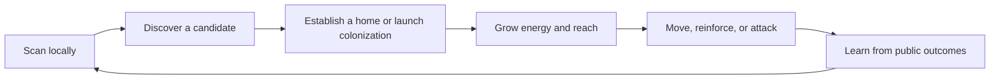

# Game Design

## Design goal

Create a strategy game where private knowledge, timing, and relationships matter more than transaction speed or asset wealth. A complete season must tell a story with a beginning, escalation, public climax, and deterministic end.

## Core loop



Each step should create a meaningful choice:

- **Scan:** spend local time and attention to improve private knowledge.
- **Establish:** use the one-time home claim or send a fleet that creates and contests a neutral planet.
- **Grow:** decide between local safety, expansion, and preparation.
- **Move:** reveal direction indirectly through source and destination commitments and arrival timing.
- **Interact:** fight, reinforce, coordinate, bluff, or withhold.
- **Learn:** update a private map using only information legitimately observed.

## Season structure

### Tutorial universe

- Isolated and resettable.
- No Soul required.
- Teaches map privacy, proof generation, claiming, movement, arrival, and settlement.
- Target completion time: 8–12 minutes.
- Uses sponsored transactions and a denser, smaller tutorial universe. If it ever uses a simpler circuit, that circuit has a separate domain, verifying key, and non-ranked state.

### Testnet Alpha season

- Seven days of live play.
- 100–300 active players.
- One ruleset and one ranked Human League.
- Fixed start and end times.
- No mid-season balance changes.
- One public beacon objective activated at a manifest-declared time from fresh Sui randomness.

### Mature cadence hypothesis

- Fourteen days live.
- Seven days intermission for settlement, chronicle review, balance analysis, and the next universe reveal.
- Multiple worlds only after one world has healthy concurrency and social density.

## World generation

The map is a deterministic mathematical space seeded after enrollment closes. A one-way, permissionless `open_universe` transition samples Sui's onchain `Random` object at the manifest-declared time, stores the seed, and cannot be retried. Its execution is fixed and bounded, with no caller-controlled “accept this seed” branch. A local miner then searches coordinate candidates and derives planet properties. The proof system establishes that a claimed or targeted commitment corresponds to a valid coordinate and satisfies the relevant geometry rules without publishing the coordinate.

World generation must provide:

- Sufficient density for early discovery without trivial saturation.
- A range of planet levels and resource identities.
- Spatial regions that create frontiers rather than isolated solo play.
- Deterministic results across TypeScript, Circom, Rust, and Move implementations.
- Explicit coordinate, field, and fixed-point bounds.

The manifest pins the derivation domain and opening time before enrollment. The seed itself is sampled only after enrollment, so operators cannot pre-mine candidate universes or choose among seeds. The same pattern activates the later beacon with a fresh random sample. If the preferred caller is absent, any account can invoke the transition; there is no reveal secret to withhold.

## Discovery and ownership

Local discovery does not grant ownership.

- `claim_home` is a once-per-Seat exception that creates one valid, unclaimed home planet with the declared starting state.
- `move_new` creates a valid destination as a neutral planet and registers a colonization arrival in the same transaction.
- The neutral planet changes owner only when that arrival is settled under the normal combat/colonization rules.
- Finding or publishing a location commitment alone creates no property right.

This keeps exploration valuable without letting a scanner acquire territory without spending in-world resources.

## Planet model

The first version should keep planet state intentionally small:

```text
location_hash
owner_seat
level
planet_type
energy
energy_cap
energy_growth
range
speed
defense
last_updated_at
pending_arrivals
source_nonce
control_since
```

Energy updates lazily when the planet is touched. The Move package computes current energy from `last_updated_at`, the immutable ruleset, and the Sui Clock. Clients may predict the same value for display, but Move performs the authoritative calculation.

Planet upgrades should be shallow in Season 0. Every additional branch expands circuit assumptions, balance risk, UI complexity, and audit surface.

## Movement and arrivals

A move specifies a source commitment, destination commitment, energy amount, source-planet nonce, deadline, and action kind. A zero-knowledge proof establishes the static geometry and binds the action. Move validates live ownership, available energy, range rules, action freshness, and the currently pinned circuit version.

The move creates or appends a bounded arrival record. On settlement:

1. Bring the planet's lazy energy forward to the relevant timestamp.
2. Process due arrivals in deterministic `(arrival_time, arrival_id)` order.
3. Apply reinforcement or combat using integer-only canonical math.
4. Update ownership, energy, counters, and events.
5. Reject any path that could iterate over an unbounded queue.

The initial protocol caps pending arrivals per destination and the number processed in one call. An action may proceed only when both source and destination are fully advanced to its action timestamp. If either has more due arrivals than the action path can process, the action aborts with `EPlanetNeedsSettlement`; the client or any keeper calls bounded `settle_due` repeatedly and retries. Partially settled state can never be used for a new move.

The manifest declares `movement_close_at` and `season_end`. Dispatch is rejected unless its computed arrival time is at or before `season_end`; no voyage can become newly effective after the competitive cutoff. Arrivals accepted before closing may be physically settled later, but Move evaluates them at their canonical arrival timestamps capped by the season rules.

## Combat

Combat should be legible enough for a player to forecast locally:

- Friendly arrival adds surviving energy up to declared limits.
- Hostile arrival is reduced by travel decay, then compared against effective defense.
- Ownership changes only when the attack exceeds the defended energy under exact integer rules.
- Ties resolve deterministically and are covered by golden vectors.
- No hidden server-side randomness.

The first season should not include critical hits, loot tables, or probabilistic combat. Uncertainty should come from other players' private information and timing.

## Diplomacy

Season 0 may support social coordination before formal alliance contracts. The protocol should still emit facts that can later support relationships:

- Reinforcement sent and received.
- Joint beacon contributions.
- Repeated non-hostile proximity where privacy permits.
- Public declarations or signed commitments, if introduced.

Formal alliances should be added only when their exit, betrayal, score-sharing, and sybil consequences are specified. A chat message is not an onchain guarantee.

## Endgame: the Beacon

Pure territorial accumulation often lets an early leader quietly compound. A public beacon creates a visible final conflict and makes cooperation useful.

Initial protocol:

- One special, public-coordinate beacon planet is created from fresh Sui randomness at the declared final-phase activation time.
- Players interact with it through ordinary proof-bound moves.
- Its owner and `control_since` timestamp are public.
- After movement closes and all arrivals due by `season_end` are drained in bounded calls, anyone can call `finalize_beacon`.
- A Seat wins the primary objective only if it controls the beacon continuously for the manifest-declared hold window ending at `season_end`; otherwise the season records no beacon winner.
- Finalization writes the winner or no-winner result once and cannot be retried.

This rule is deliberately bounded and avoids iterating every planet or Seat. The hold window reduces last-block sniping without inventing an offchain judge. Its duration remains a balance hypothesis and must be simulated against snowballing, collusion, multi-account sacrifice, griefing, and dominant-alliance capture.

## Scoring principles

- Reward interaction and contested objectives, not transaction count.
- Cap or diminish repetitive farming between the same seats.
- Avoid rewarding mere wallet age or Soul history.
- Store each Seat's bounded objective counters in an onchain `ScoreCard` and make them reproducible from checkpoints.
- Publish the formula and weights before enrollment closes.
- Use rule-defined score/achievement bands and the beacon-winner flag for permanent records. The UI may sort frozen ScoreCards into an exact leaderboard with a declared `seat_id` tie-break, but exact rank is a derived view and is not used to distribute Season 0 protocol rewards.

Beacon-related pending actions increment a bounded counter on the source Seat's ScoreCard and decrement it when settled. A Seat record cannot finalize while that counter is nonzero or before the beacon result is final. This gives individual finalization without a global loop.

## Human and agent play

Ranked Human League and Open Agent League must be separate products with separate leaderboards and authorization.

Human League may allow accessibility helpers, transaction batching, and local route previews, but its ban on autonomous strategic play is a competition policy—not a cryptographic property. Local mining, proving, and transaction submission cannot reliably reveal whether a human or an agent chose the action. Enforcement therefore relies on published rules, limited evidence, and reviewable sanctions attached to the Seat/controller; invasive telemetry is not silently added.

Open Agent League can later expose a documented command API through `WorldCommandCap`, with rate limits and explicit telemetry. A general Soul permission grant is not sufficient authority for an agent to control an empire.

The Alpha label should be **Human League (policy-enforced)**. The product must not claim bot-proof play. It should make obvious abuse reviewable and avoid mixing incompatible competition modes.

## Economy

Season 0 uses closed, non-transferable strategic resources. There is no fungible token and no extraction loop.

Potential later monetization must pass three tests:

1. It does not change ranked combat or economy outcomes.
2. It remains understandable without financial language.
3. The game would still be worth playing if resale value were zero.

Acceptable candidates include cosmetic commander projections, commemorative presentation, private-world hosting, and tournament services. Tradable energy, map knowledge, combat bonuses, and ranked-entry advantages are excluded.

## Anti-frustration requirements

- A failed proof or transaction must explain whether the cause is local proving, stale state, invalid geometry, sponsorship, or chain execution.
- The client must simulate when possible before asking for a signature.
- A player who loses the home planet should retain a bounded recovery path until the declared elimination phase.
- Congestion must not silently favor players with faster RPC access.
- The game must offer encrypted local map export and recovery warnings; losing browser storage should not be a surprise.
- Settlement and season-end behavior must be visible before a player commits a high-value move.

## Questions for playtesting

- Is searching intrinsically satisfying after the first hour?
- How much public information is needed for diplomacy without collapsing map privacy?
- Does the beacon reverse snowballing or merely concentrate it?
- Does proof latency feel like anticipation or friction?
- Can a new player create a meaningful story without competing for first place?
- Do Soul chronicles reflect choices, or only leaderboard outcomes?
