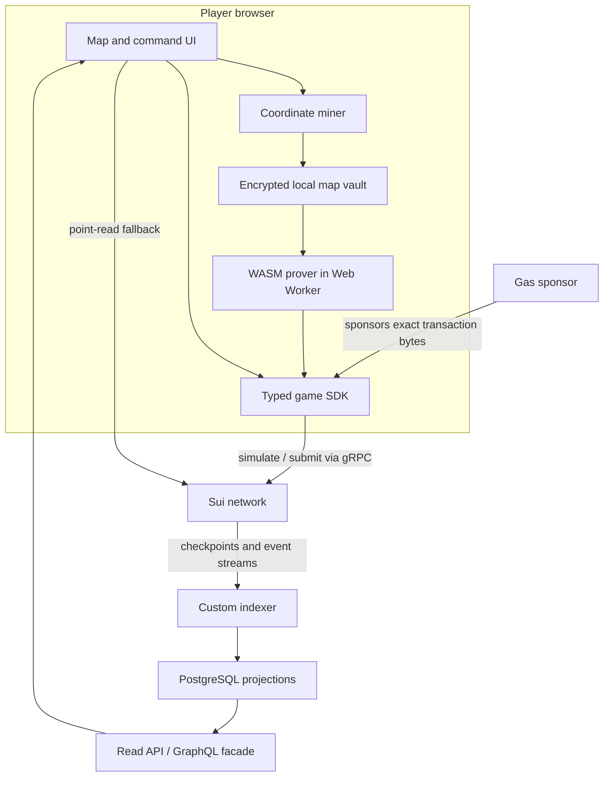

# Technical Architecture

## Architecture objective

Build a game whose authoritative state can be reconstructed from Sui, whose hidden geometry can be proven without disclosure, and whose hot paths scale by planet or player rather than through a single mutable universe object.

This document defines the target shape. The exact Move APIs and object schemas remain provisional until the technical go/no-go prototype measures contention, gas, proof latency, and cross-language determinism.

## Trust boundary

| Concern | Authoritative location |
| --- | --- |
| Season timing and rules | Sui objects and Move package |
| Planet ownership and energy | Sui shared objects |
| Fleet creation, arrival, and combat | Move transitions |
| Score and settlement | Move transitions and receipts |
| Coordinate preimages | Player device only |
| Search/mining | Player device only |
| Proof generation | Player device by default |
| Transaction sponsorship | Replaceable service; cannot alter action |
| Query projections | Rebuildable indexer/PostgreSQL |
| Rendering and animation | Client |
| Narrative prose | Client/service, labeled as interpretation |

No backend signature may substitute for a game-valid zero-knowledge proof or a required player capability.

## System overview



## Ecosystem integration boundary

The multiplayer engine is a dedicated package, not an orchestration wrapper around the other products:

| Dependency | Read or composition path | Prohibited coupling |
| --- | --- | --- |
| Soulidity | Validate pinned interface, canonical `SoulState`, current owner, and ownership epoch; optionally reference directly holder-signed Chronicle memory later | No custody, automatic memory write, general-grant command authority, or gameplay from editable metadata |
| Animacraft | Snapshot an accepted public projection and provenance commitments at enrollment | Provenance/terms commitments are not display permission; require a separate accepted license resolver or use neutral fallback |
| Infinite Flow Engine | Optionally host a separate Soul-bound prologue or PvE Scene with independent Run history | No guest tutorial, ranked progression input, or representation of Season, Planet, Arrival, or score authority as a SoloRun |

The official client may present these systems as one journey. Onchain authorization and release evidence still preserve their separate authorities.

## Onchain object topology

### Immutable season configuration

`UniverseRules` is created for a specific rules version and frozen. It contains all numerical constants required to replay state transitions: growth curves, travel decay, range tables, combat rules, queue bounds, score weights, and protocol version IDs. Phase timestamps exist only in the Season Manifest.

`CircuitConfig` is also frozen and contains:

- Circuit version and domain.
- Curve identifier.
- Prepared verifying key or its canonical reference.
- R1CS, WASM, proving-key, and verifying-key hashes.
- Public-input schema version.
- Field-encoding version.

`SeasonManifest` references the exact engine package, Soulidity dependency/interface, accepted projection and display-license policy, rules, circuit, reference-client core, and metadata hashes. It is the sole authority for base enrollment close, universe opening, `home_claim_open_at`, competitive start, `home_claim_close_at`, recovery close, Last Light activation, movement close, season end, settlement window, and record-finalization timestamps. It also freezes a nonzero `seed_observation_delay_ms`, `minimum_home_claim_window_ms`, `max_home_availability_tick_gap_ms`, `max_ranked_seats`, the enrollment-capacity object, enrollment-registry parent IDs, shard count/function/key-encoding version, ranked-scope/league policy, the `Commander` role-schema ID, recovery domain/budget, bounded Beacon candidate-domain construction and commitment, maximum extension, allowed extension causes/windows, cancellation/refund policy, and legal runtime-transition schema. Manifest validation requires `0 < max_home_availability_tick_gap_ms < minimum_home_claim_window_ms`, so one late tick after a completely unevidenced window cannot alone authorize player elimination.

`SeasonRuntime` is a small shared object containing one-way runtime facts: universe-opened and its Clock timestamp, sampled universe seed, beacon-activated, beacon reference, paused, home-availability last-tick time, accumulated home-claimable milliseconds, `home_window_resolution` (`Pending`, `ClosedAvailable`, or `CancelledUnavailable`), total extension used, fixed-size per-phase extension offsets, cancelled/reason, settlement-started, and final beacon result. Pause/resume updates only bounded scalar fields. A phase's effective time equals its frozen base time plus its monotonic phase-specific offset.

Because Move cannot infer a chain-wide outage from elapsed wall time alone, cumulative home availability is credited by a permissionless, fixed-cost `tick_home_availability` transition rather than reconstructed from event history. The opening transition initializes the lower bound to `home_claim_not_before_at`; if that bound changes legally before it arrives, the same manifest-derived value is advanced monotonically without credit. While the claim gate is open and unpaused, each tick adds at most the saturating Clock interval since the prior tick, capped by `max_home_availability_tick_gap_ms` and by the half-open window `[home_claim_not_before_at, effective_home_claim_close_at)`. Pause settles the preceding eligible interval before toggling; resume advances the last-tick time without crediting the paused interval. A close resolver performs the same capped settlement. A long checkpoint or caller gap therefore cannot be misclassified as fully available time: missing timely evidence undercredits availability and takes the global cancellation/refund path rather than eliminating waiting players. Anyone may tick, and the reference sponsor does so; ordinary gameplay actions still borrow the runtime immutably, so periodic availability evidence does not enter each play transaction.

An extension event names one manifest-approved suffix of future phase boundaries and adds the same delta to every boundary in that suffix. It must execute strictly before the earliest affected boundary's current effective time, preserve phase order, and remain under the total extension cap. A boundary whose time has arrived or whose one-way transition has committed is immutable: enrollment, universe opening, home-claim opening or closing, recovery, Beacon activation, movement, or another completed phase can never reopen. After movement closes, for example, an allowed operational extension may move a settlement/finalization deadline but cannot resume competitive movement or change the finished season end.

`PauseCap`, `ExtensionCap`, and `CancelCap` are separate. Their entry points enforce manifest-defined hard limits, time windows, reasons, and irreversible states, and emit events. `PauseCap` can settle availability counters and toggle pause but cannot move a deadline. If future slack no longer preserves the minimum window, only an `ExtensionCap`-authorized transition may add the exact required delta to still-future boundaries, either separately or atomically in the same programmable transaction as resume. If that transition is unavailable or illegal, the season remains eligible for the predeclared close-time cancellation; pause authority never implies extension authority. Permissionless, fixed-cost entropy transitions sample Sui `Random` once at their effective declared times and always commit the result; they have no output-dependent abort path that would permit seed grinding. Before Beacon entropy is requested, a permissionless bounded validation transition must attest that every committed candidate meets the manifest's reachability and timing rules. A failed domain takes the predeclared cancellation/no-winner path before sampling and cannot trigger a replacement domain or second draw.

`HomeSearchAvailableAt` is the ordered finalized effect position at which the universe-opening seed first exists for a finalized `AwaitingHome` Seat. From that point, authoritative local mining and proving are possible even when `claim_home` is paused or not yet open; a protocol cannot prevent a custom client from speculating on publicly observed pre-checkpoint effects. To prevent an immediate claim, `home_claim_not_before_at = max(effective_home_claim_open_at, universe_opened_at + seed_observation_delay_ms)`, where the manifest-frozen delay is nonzero and sized against the published finality budget. `claim_home` rejects before that Clock boundary. This is a transparent observation buffer, not a claim that two consensus commits must land in different checkpoints. `HomeClaimAvailableAt` is the first ordered finalized effect position at or after search availability where `home_claim_not_before_at` has arrived, effective `home_claim_close_at` has not arrived, and the claim path is neither paused nor cancelled. Neither anchor is an indexer-observation timestamp or a Seat-creation event.

The reference client may warm code and proving assets after a verified executed effect, but it destroys pre-final candidates, witnesses, and proofs and restarts authoritative search at `HomeSearchAvailableAt`. The five-minute release benchmark therefore includes all reusable search/proof work. A custom client can speculate earlier; that residual public-information advantage is disclosed and bounded by the observation delay rather than denied.

Both anchors are represented by checkpoint sequence, transaction/effects ordinal, and canonical onchain Clock time; opening and claim events record their Clock times explicitly. An opening/resume state change uses its exact effect ordinal. When availability arises only because Clock time crosses a frozen boundary, it uses a canonical start-of-checkpoint sentinel at the first finalized checkpoint whose timestamp satisfies the boundary. They evaluate the Seat's state immediately before a causally later claim. Opening or resume and claim may share a checkpoint; ordinal plus recorded Clock time preserves their causal order and elapsed time instead of losing the anchor because checkpoint-end state is already `Active`.

`minimum_home_claim_window_ms` means cumulative onchain-evidenced, unpaused claimable duration, not wall-clock distance between two base timestamps. Delayed opening and any claim-path pause must preserve that minimum through a manifest-predeclared monotonic extension of still-future boundaries or take the cancellation path. At effective close, a permissionless resolver checks the bounded availability accumulator: with sufficient credited claimable time it irreversibly sets `home_window_resolution = ClosedAvailable` and permits per-Seat `HomeNotEstablished`; otherwise it sets `CancelledUnavailable`, enters the manifest's global `HomeWindowUnavailable` cancellation/refund state, and stops the universe. This same conservative rule covers an outage or missing ticker through close without pretending that Move can reconstruct unavailable wall time after the fact. No operator signature or non-expiring `AwaitingHome` fallback is allowed. Operators cannot silently shorten the window, reopen a passed close, or classify unevidenced availability as player failure. Any pre-competitive home window clamps starting energy and growth to the shared competitive start and rejects all other strategic actions before that boundary.

After effective home close, every strategic, settlement-start, and record-finalization entry point for every Seat must atomically call or require `home_window_resolution != Pending`. This global guard prevents an Active Seat from acting or freezing a receipt before a later waiting Seat triggers universe-wide cancellation. No direct `AwaitingHome -> Settled` edge exists: `ClosedAvailable` first permits `Eliminated(HomeNotEstablished)`, while `CancelledUnavailable` applies the shared cancellation/refund policy to the whole universe.

### Enrollment and identity

For the ranked Alpha, `SeasonSeat` is an immutable/read-only derived identity with a controller fixed at enrollment. Human actions validate `ctx.sender()` against that controller. Sponsored transactions retain the player as sender while a sponsor supplies gas. Mid-season controller recovery and transfer are intentionally out of scope.

The logical `ControllerLeagueSeasonSlot` is keyed by the canonical encoding of `(domain, season_id, league, controller)` and remains consumed for the entire ranked scope. `SeasonSeat` itself is derived under the manifest-selected enrollment-registry parent, making its ID both the uniqueness claim and direct controller-to-Seat route. Every client and indexer uses the manifest-pinned parent IDs, shard count/function, domain, field widths, and key-encoding version with shared vectors. This enforces one address, not one human; a future stronger identity policy requires a separate eligibility credential or nullifier.

`EnrollmentCapacity` is a bounded shared object used only during enrollment. It freezes `max_ranked_seats` and tracks `created_count`; enrollment checks and increments it atomically with all identity effects. This localized enrollment bottleneck never enters ordinary play. The 100–300 Seat P0 load test must show acceptable contention; any future sharded capacity design must preserve an exact total and manifest-pinned routing rather than silently oversubscribe.

The fixed-controller choice avoids putting a mutable, owned empire capability into every action. A future delegation design may introduce a separate `EmpireControlCap`, but it must not be a Soul or a general Soul grant.

`CommanderProjection` binds the Seat, canonical Soul, accepted Animacraft visual or fallback, ownership epoch, and manifest-frozen `Commander` role-schema ID for a term. `SoulSeasonSlot`, deterministically keyed by `(season_id, soul_id)`, and the single immutable Projection reference on the Seat enforce one Soul per Seat and one commander binding per Seat for the full ranked season. Together with the controller key, all uniqueness claims remain consumed after missed activation, transfer, detachment, elimination, cancellation, or settlement. The projection stores the Soul's current ownership epoch, accepted visual/provenance commitments, validated `ProjectionDisplayLicense` reference, and fallback reference. It becomes logically stale as soon as the ownership epoch changes.

`SoulSegmentAccumulator` stores a projection-local attribution nonce, bounded counters, achievement bits, last-valid-attribution time, and a rolling commitment. Every update passes canonical `SoulState` and validates projection status, IDs, current owner, and ownership epoch in Move. It never reconstructs facts from indexer events.

Ranked enrollment is one atomic transition. It derives the controller exclusively from `ctx.sender()`, requires that sender to equal the canonical current Soul owner, validates phase, remaining capacity, package/interface, Soul/SoulState IDs, epoch, listing state, doctrine, visual, and display policy, increments capacity, consumes all uniqueness claims, and creates the `SeasonSeat`, `CommanderProjection`, `SoulSegmentAccumulator`, `ScoreCard`, unused Seat-bound home state, and `CivilizationState(status = AwaitingHome)`. It creates no Planet. `ESeasonFull`, a capacity race, or any other abort leaves none of these effects.

`CivilizationState` stores bounded per-seat aggregates: lifecycle status, controlled-planet count, qualifying pending-capture count, home/recovery status, `initial_home_planet_id`, and whether its unique `RecoverySlot` was consumed. `AwaitingHome` means zero Planets, unused home claim, never activated, and no permission to move, colonize, score, or recover. These counters are updated atomically with ownership and arrival settlement so recovery and elimination never depend on an indexer scan. `ScoreCard` stores bounded scoring counters and pending scored-arrival count. Neither contains private coordinates or a growing vector of historical actions.

`HomeClaimSlot` names logical one-use state, not a transferable player capability. It is either stored directly in `CivilizationState` or as a non-`store` child/record deterministically bound to `(season_id, seat_id)`. `claim_home` must validate the same season and Seat across controller, Seat, lifecycle, slot, ScoreCard, registry, and created Planet; a slot or Civilization from another Seat cannot be substituted in a programmable transaction.

Strategic authorization and Soul attribution are separate predicates. Every pure Seat action validates the fixed controller, lifecycle, phase, proof, and state without requiring a live Soul or updating its accumulator. An attributed variant additionally validates canonical Soul ownership and epoch before strategic mutation. After transfer, the original controller retains the pure Seat path and deterministic Seat lookup; the buyer gains neither control nor vault access.

At settlement, the Infinite Stellar engine freezes external `InfiniteStellarSeatReceipt` and `InfiniteStellarSoulSegmentReceipt` objects. A Soul career UI aggregates them by `(soulidity_package_id, soul_state_id, soul_id)`; the current Soulidity core is not mutated. Optional narrative memory is a later transaction directly signed by the current holder under the official Infinite Stellar policy; the game does not exercise delegated `SoulGrant` memory authority.

### Future Open Agent authorization

Open Agent League is not enabled until a dedicated authorization lifecycle exists. `WorldCommandCap` should have `key` but no `store`, be issued only by the fixed Seat controller to a declared grantee, and contain:

```text
season_id
seat_id
grantee
control_generation
action_mask
expires_at
per_action_limit
aggregate_spend_or_stake_limit
cap_nonce
```

The Seat's shared `AgentControlState` stores the current generation and bounded issuance policy. Revocation increments the generation, invalidating all older caps even though the controller cannot mutate an object held by the agent. Every agent call checks sender, generation, mask, expiry, nonce, limits, and the Soul live predicate when requesting Soul attribution. Expired caps can be destroyed through a bounded public cleanup path. A future Seat recovery also increments the control generation before any new cap is issued.

### Planet namespace

Do not place all planets inside a global `Universe` table.

The preferred hypothesis is a small fixed set of `SectorRegistry` shared objects. `claim_home` or `move_new` uses one registry shard and a public `location_hash` as the key to claim a deterministic derived object ID. This gives one-per-key uniqueness, not ownership. From `AwaitingHome`, a successful `claim_home` validates the matching logical home slot and atomically consumes it, creates the one Founding Planet with `owner_seat_id = seat_id`, records `initial_home_planet_id`, increments the controlled count, and changes the Civilization to `Active`. A failed proof, occupied location, rejected signature, sponsor failure, cross-Seat substitution, or abort changes none of those facts. `move_new` creates a neutral destination whose arrival must later colonize it. After creation, the resulting `Planet` is a top-level shared derived object and ordinary updates do not require the registry.

The shard function must depend only on the location commitment and season domain, not on private coordinate bits that would leak geography.

Benefits to verify:

- Claims spread across registry shards.
- Existing planets mutate independently.
- Clients can calculate planet object IDs from public inputs.
- No indexer is needed to prove uniqueness.

The creation path still mutates one registry shard. Claim storms and adversarial shard concentration must be benchmarked.

### Planets and arrivals

`Planet` contains current compact state and a bounded pending-arrival index. A movement transaction updates the source, creates an `Arrival` or `Fleet` object, and registers a bounded reference at the destination. This deliberately makes simultaneous writes to the same destination contend: the destination is the natural serialization boundary for its own combat.

The prototype must compare:

1. A compact arrival vector stored directly on the planet.
2. Independent arrival objects plus a bounded, authoritative destination index.

Independent arrival objects without an authoritative destination reference are unsafe because a player could selectively delay presenting an unfavorable due arrival.

Arrival processing is deterministic by `(arrival_time, arrival_id)`. Every collection and loop has a protocol constant. If more arrivals are due than an action path can handle, the action aborts before mutation and repeated permissionless settlement advances the planet until no arrival due at the action timestamp remains. New actions cannot observe or act on a partially advanced planet.

Movement dispatch is rejected when the computed arrival would fall after `season_end`. This removes ambiguous post-season voyages. Physical settlement may occur later, but it applies the stored arrival timestamp and cannot extend production or control beyond the declared cutoff.

## Suggested Move modules

```text
infinite_stellar::rules           immutable tables and fixed-point math
infinite_stellar::season          manifest, phases, enrollment, settlement
infinite_stellar::identity        seats, commander projections, Soul validation
infinite_stellar::registry        sharded claim namespace and derived planets
infinite_stellar::planet          lazy production, ownership, upgrades
infinite_stellar::movement        proof-bound dispatch and arrivals
infinite_stellar::combat          deterministic reinforcement and combat
infinite_stellar::score           beacon and season scoring
infinite_stellar::entropy         one-way universe and beacon randomness transitions
infinite_stellar::receipts        public events and Soul season records
infinite_stellar::admin           narrowly scoped operational capabilities
```

Module boundaries should make invariants testable. Avoid a generic admin module that can rewrite live player state. Every season pins the exact Soulidity package and interface version whose public getters it validates.

## Time and lazy state

Energy and other continuous-looking values use integer fixed-point math and update lazily:

```text
elapsed = min(now, season_end) - last_updated_at
new_energy = min(cap, old_energy + growth_per_unit * elapsed)
```

The actual formula may be nonlinear, but it must have:

- Exact bounds that prevent overflow.
- The same rounding direction in every language.
- A declared timestamp unit.
- A maximum elapsed interval.
- Golden vectors for boundary timestamps.
- No client-controlled clock.

Sui Clock is read by Move for authoritative time. UI predictions are advisory.

## Zero-knowledge circuit design

### Proof statement

For a movement action, the prover should establish that it knows source and destination coordinate preimages such that:

- Each coordinate is within declared signed bounds.
- Each coordinate hashes to its public location commitment under the season domain.
- The destination lies within the declared world geometry.
- The squared distance is within the public or committed maximum allowed by the action.
- Any deterministic spatial property required by the rules is correctly derived.
- The proof is bound to the exact action intent and cannot be replayed for another sender, season, action-specific proof amount, or destination. In interface v1, the `move` proof amount is the maximum route distance; energy and silver remain separate live-state transaction arguments.

Static geometry belongs in the circuit. Current energy, ownership, time, queue capacity, combat, and scoring belong in Move.

### Public inputs

Sui's Groth16 Move API currently supports at most eight public inputs. Circuit outputs are public signals and must be counted. The historical Dark Forest v0.6 movement circuit exposes seven explicit public inputs and three public outputs, so it cannot be adopted unchanged under this limit.

The new circuit should compress the action into a domain-separated commitment. The logical payload is:

```text
domain
proof_interface_version
network
season_id
league
seat_id
sender
source_location_hash
destination_location_hash
amount
action_kind
source_planet_nonce
deadline
rules_geometry_commitment
```

These logical fields do not each need a public signal. They can be canonically encoded and hashed into one or more field elements, provided the design specifies length prefixes, integer widths, endianness, field reduction, and collision resistance. Inside the circuit, `source_location_hash` and `destination_location_hash` are derived from the private coordinates, and `action_commitment` is constrained to equal the domain-separated hash of the entire canonical tuple above. Move independently recomputes that same commitment from transaction arguments before verifying the proof.

`source_planet_nonce` is stored and incremented on each source planet. It prevents replay without a Seat-global nonce that would invalidate proofs for unrelated source planets. Current destination state is deliberately not proven; Move reads and serializes it at execution.

Proof interface v1 freezes this public schema:

```text
source_location_hash
destination_location_hash
action_commitment
rules_geometry_commitment
```

`rules_geometry_commitment` is derived inside the circuit from the schema/domain, world radius, exact planet-hash threshold, location/space keys, Perlin scale and mirrors, and the inclusive/exclusive home band. Move recomputes the same Poseidon value from immutable `SeasonManifest` fields; an unconstrained configuration hash is not acceptable. The exact 16-field Poseidon action tuple, identifier limbs, four-signal order, BN254 limits, little-endian scalar serialization, Arkworks point serialization, and mainnet golden vector are normative in [`16-proof-interface-and-artifact-preflight.md`](16-proof-interface-and-artifact-preflight.md) and [`config/proof-interface-v1.json`](../config/proof-interface-v1.json). TypeScript, Circom, and Move agree on that interface, and a tracked development vector verifies in Sui's native Groth16 implementation. Production artifacts, ceremony keys, independent audit, and key pinning remain unavailable before any ranked write.

### Circuit stack

- Circom 2.2.3 source for the complete but unaudited development relations.
- BN254 Groth16 unless benchmarks justify BLS12-381.
- A circuit-friendly hash such as Poseidon for coordinate and action commitments.
- Pinned `snarkjs` 0.7.6 for current browser proof generation and self-verification.
- Sui `groth16` Move API for verification.
- Reproducible build containers and pinned toolchain versions.

The choice of hash, parameters, and libraries is security-critical. Do not mix ad hoc Poseidon parameter sets across languages.

### Trusted setup

Development keys are never production keys. Before a valuable mainnet season:

1. Freeze the audited circuit source and build environment.
2. Publish the circuit identifiers and artifact hashes.
3. Run a circuit-specific multi-party Phase 2 ceremony.
4. Publish contribution instructions, transcript, verification procedure, and final hashes.
5. Pin the accepted verifying key in `CircuitConfig` and the season manifest.
6. Refuse proofs from any unpinned circuit or key.

Any circuit change requires a new version and, where required by Groth16, a new setup.

## Client architecture

### Local map vault

The client stores coordinate preimages, discoveries, labels, and derived routes in an encrypted local vault. Its authenticated namespace is derived from a domain tag plus chain identifier, engine package, season, Seat, and fixed controller—never Soul ID alone. The user must be able to export, restore, and verify it. Encryption uses a random data key with an explicit wrapping/unlock flow; a wallet signature is not assumed to be a deterministic encryption key. Keys and contents must never be sent to analytics or support services.

Restore fails closed and leaves existing data untouched for a wrong network, package, season, Seat, controller, password, schema, or authentication tag. Missing, locked, corrupt, incompatible, and restorable states remain distinct. A new season receives a new namespace, and Soul transfer never grants the buyer a vault route.

The client treats browser storage loss as a major risk and warns before formal season entry. Before submitting `claim_home` or `recover_home`, it durably encrypts the candidate coordinate, salt, commitment, derivation version, namespace, and pending transaction state. Reload promotes a pending record only when its saved digest/effects or exact commitment-derived Planet ID matches the canonical `initial_home_planet_id`/recovery effect. `Seat == Active` alone is insufficient: if another tab or device finalized candidate B while A is pending, A becomes `Superseded`, both records are preserved, and missing B secrets are surfaced. Recovery design is a product requirement, not post-launch polish.

### Miner and prover

Mining and witness generation run in Web Workers to keep rendering responsive. The worker protocol accepts narrowly typed messages and never receives wallet signing authority. Proof artifacts are content-addressed and checked against the active manifest before use. The implemented preflight verifies the manifest hash, network, ruleset, circuit/version, production setup provenance, role uniqueness, HTTPS/same-origin policy, media type, byte length, per-artifact SHA-256, aggregate memory budget, cancellation, and stale request IDs. Successful preflight leaves bytes inside the Worker; it does not make a circuit audited or enable the production verifier.

Performance targets for the go/no-go build:

- Desktop proof p95: at most 5 seconds.
- Hard stop for default interaction: over 10 seconds on reference desktop hardware.
- Mobile proof target, if mobile remains in scope: at most 15 seconds.
- Peak prover memory: at most 512 MB on the reference device class.

A remote prover is not the default because coordinates are private witnesses. If an optional remote or trusted-execution path is explored, its privacy model must be explicit and opt-in.

### Transaction construction

The SDK builds the full action locally, including public arguments, nonce, deadline, proof bytes, and required object IDs. It simulates the transaction when supported, presents a meaningful summary, and only then requests a signature.

For sponsorship, the sponsor signs or co-signs the exact transaction bytes after applying rate and policy checks. It cannot substitute a destination, amount, or proof.

## Data access and indexing

New code should use Sui gRPC for transaction execution, point reads, and checkpoint/event streams, with GraphQL where aggregated query semantics are useful. Do not introduce a new JSON-RPC dependency: Sui has deprecated that interface and published its shutdown timeline.

The custom indexer consumes checkpoints and writes projections to PostgreSQL:

- Public map state.
- Planet timelines.
- Arrival and combat history.
- Seat and leaderboard projections.
- Soul season records and relationship receipts.
- Operational transaction/error aggregates stripped of private inputs.

The indexer also projects controller-to-Seat routing, lifecycle, universe-opening, pause/cancellation, and home-claim phase facts. It may accelerate `HomeSearchAvailableAt`, `HomeClaimAvailableAt`, and onboarding funnels but cannot define them. Both ordered anchors are reconstructible from finalized Seat, manifest, runtime, and checkpoint history without client timestamps or private identifiers in an analytics graph.

The indexer stores a durable checkpoint cursor and supports a full rebuild from checkpoint data. A release cannot depend on database rows that cannot be reproduced. The client should expose the checkpoint or transaction digest behind important state so advanced users can verify it.

## Canonical math and test vectors

Cross-language drift is a consensus-adjacent risk. Create one versioned vector corpus covering:

- Signed coordinate encoding.
- Field conversion and rejection rules.
- Domain-separated hashes.
- Distance and world-boundary checks.
- Fixed-point growth and travel decay.
- Combat ties and rounding.
- Action commitment encoding.
- Arrival ordering.
- Season phase boundaries.

The same vectors run in Circom witness tests, TypeScript, Rust, and Move. A release is blocked if any implementation disagrees.

## Upgrade and capability model

- Each production season engine contains the state-transition logic used by that season and is made immutable by consuming its Sui `UpgradeCap` before the manifest is finalized. A code change is a new engine package for a later season.
- Any dependency capable of changing active transition semantics is also pinned to an immutable version; a manifest hash alone is not treated as enforcement.
- `PauseCap`, `ExtensionCap`, and `CancelCap` are separate and can perform only the transitions and bounds frozen in the manifest.
- Settlement and recovery paths remain permissionless wherever safely possible.
- No capability can rewrite coordinates, fabricate score, or seize a healthy civilization.
- Emergency actions emit explicit events and are covered by the incident policy.

## Technical acceptance criteria

The architecture is viable only if the prototype demonstrates:

- No mutable global object on ordinary action paths.
- Every implementation derives the same Seat ID from the manifest-pinned registry parents, shard configuration, and typed controller key; concurrent enrollment cannot create two ranked Seats for one controller, league, and season.
- The exact final Seat capacity cannot be exceeded; a full/capacity-race or other aborted enrollment changes neither capacity nor controller, Soul, or commander claims.
- Enrollment creates `AwaitingHome` without a Planet; exactly one finalized `claim_home` creates the Seat-owned Founding Planet and changes the lifecycle to `Active`.
- `AwaitingHome` rejects movement, scoring, and `recover_home`, including at exact home-claim boundaries.
- Fixed-controller lookup resumes the same Seat after Soul transfer, including a pure `claim_home` from `AwaitingHome` with no Soul attribution, while the buyer receives no command or vault route.
- A nonzero Clock-enforced observation delay rejects an immediate claim and remains measurable even if opening/claim share a checkpoint; repeated pauses, delayed opening, long availability-tick/checkpoint gaps, exact close, and operator absence either credit the cumulative minimum or reach permissionless `HomeWindowUnavailable` cancellation before any Active-first action or receipt finalization.
- Vault restore, wrong-namespace rejection, concurrent candidates, and crash/reload around home submission preserve existing secrets; a pending record finalizes only on exact digest/effects or commitment-derived Planet match.
- Public proof signals at or below the supported limit.
- Correct proof rejection for mutated sender, amount, nonce, deadline, season, source, or destination.
- Bounded worst-case gas for arrivals and settlement.
- Acceptable throughput under uniform load and hot-planet contention.
- Determinism across all language implementations.
- Complete indexer rebuild from a clean database.
- No coordinate leakage in network requests, logs, telemetry, crash reports, or session replay.
