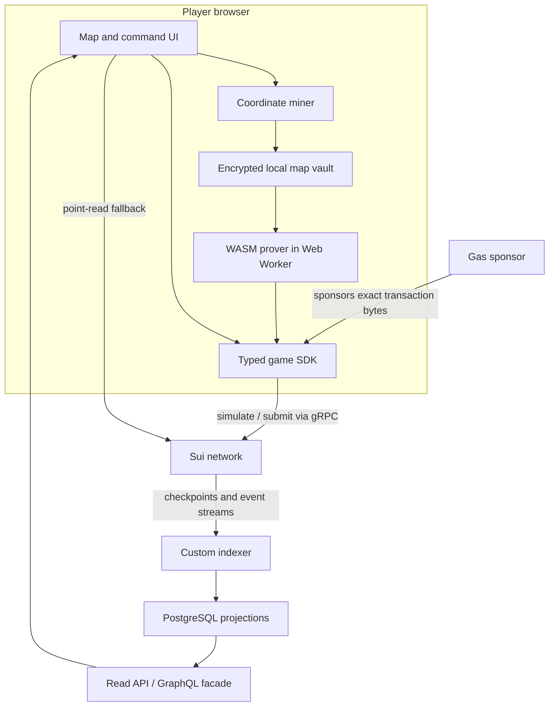

# Technical Architecture

## Architecture objective

Build a game whose authoritative state can be reconstructed from Sui, whose hidden geometry can be proven without disclosure, and whose hot paths scale by planet or player rather than through a single mutable universe object.

This document defines the target shape. The exact Move APIs and object schemas remain provisional until the technical go/no-go prototype measures contention, gas, proof latency, and cross-language determinism.

## Trust boundary

| Concern | Authoritative location |
| --- | --- |
| Season timing and rules | Sui objects and Move package |
| Planet ownership and energy | Sui shared objects |
| Fleet creation, arrival, and combat | Move transitions |
| Score and settlement | Move transitions and receipts |
| Coordinate preimages | Player device only |
| Search/mining | Player device only |
| Proof generation | Player device by default |
| Transaction sponsorship | Replaceable service; cannot alter action |
| Query projections | Rebuildable indexer/PostgreSQL |
| Rendering and animation | Client |
| Narrative prose | Client/service, labeled as interpretation |

No backend signature may substitute for a game-valid zero-knowledge proof or a required player capability.

## System overview



## Onchain object topology

### Immutable season configuration

`UniverseRules` is created for a specific rules version and frozen. It contains all numerical constants required to replay state transitions: growth curves, travel decay, range tables, combat rules, queue bounds, score weights, and protocol version IDs. Phase timestamps exist only in the Season Manifest.

`CircuitConfig` is also frozen and contains:

- Circuit version and domain.
- Curve identifier.
- Prepared verifying key or its canonical reference.
- R1CS, WASM, proving-key, and verifying-key hashes.
- Public-input schema version.
- Field-encoding version.

`SeasonManifest` references exact engine package, Soulidity dependency/interface, rules, circuit, reference-client core, and metadata hashes. It is the sole authority for base enrollment close, universe opening, start, beacon activation, movement close, season end, settlement window, and record-finalization timestamps. It also freezes the maximum extension, allowed extension causes/windows, cancellation/refund policy, and legal runtime-transition schema.

`SeasonRuntime` is a small shared object containing one-way runtime facts: universe-opened, sampled universe seed, beacon-activated, beacon reference, paused, cumulative extension, cancelled/reason, settlement-started, and final beacon result. Ordinary actions borrow it immutably, so it does not become a mutable global write bottleneck. Effective phase times equal the manifest base times plus the allowed runtime extension.

`PauseCap`, `ExtensionCap`, and `CancelCap` are separate. Their entry points enforce manifest-defined hard limits, time windows, reasons, and irreversible states, and emit events. Permissionless, fixed-cost entropy transitions sample Sui `Random` once at their effective declared times and always commit the result; they have no output-dependent abort path that would permit seed grinding.

### Enrollment and identity

For the ranked Alpha, `SeasonSeat` is an immutable/read-only derived identity with a controller fixed at enrollment. Human actions validate `ctx.sender()` against that controller. Sponsored transactions retain the player as sender while a sponsor supplies gas. Mid-season controller recovery and transfer are intentionally out of scope.

The fixed-controller choice avoids putting a mutable, owned empire capability into every action. A future delegation design may introduce a separate `EmpireControlCap`, but it must not be a Soul or a general Soul grant.

`CommanderProjection` binds the seat to a canonical Soul for a term. `SoulSeasonSlot`, deterministically keyed by `(season_id, soul_id)`, and a one-time Seat commander slot enforce one Soul per Seat and one Seat per Soul for the full ranked season. Both remain consumed after transfer. The projection stores the Soul's current ownership epoch and becomes logically stale as soon as that epoch changes.

`SoulSegmentAccumulator` stores a projection-local attribution nonce, bounded counters, achievement bits, last-valid-attribution time, and a rolling commitment. Every update passes canonical `SoulState` and validates projection status, IDs, current owner, and ownership epoch in Move. It never reconstructs facts from indexer events.

`CivilizationState` stores bounded per-seat aggregates such as home status and recovery eligibility. `ScoreCard` stores bounded scoring counters and pending scored-arrival count. Neither contains private coordinates or a growing vector of historical actions.

At settlement, the Veilworld engine freezes external `VeilworldSeatReceipt` and `VeilworldSoulSegmentReceipt` objects. A Soul career UI aggregates them by `(soulidity_package_id, soul_state_id, soul_id)`; the current Soulidity core is not mutated. Optional narrative memory is a later, separately approved Soulidity owner transaction.

### Future Open Agent authorization

Open Agent League is not enabled until a dedicated authorization lifecycle exists. `WorldCommandCap` should have `key` but no `store`, be issued only by the fixed Seat controller to a declared grantee, and contain:

```text
season_id
seat_id
grantee
control_generation
action_mask
expires_at
per_action_limit
aggregate_spend_or_stake_limit
cap_nonce
```

The Seat's shared `AgentControlState` stores the current generation and bounded issuance policy. Revocation increments the generation, invalidating all older caps even though the controller cannot mutate an object held by the agent. Every agent call checks sender, generation, mask, expiry, nonce, limits, and the Soul live predicate when requesting Soul attribution. Expired caps can be destroyed through a bounded public cleanup path. A future Seat recovery also increments the control generation before any new cap is issued.

### Planet namespace

Do not place all planets inside a global `Universe` table.

The preferred hypothesis is a small fixed set of `SectorRegistry` shared objects. `claim_home` or `move_new` uses one registry shard and a public `location_hash` as the key to claim a deterministic derived object ID. This gives one-per-key uniqueness, not ownership. A home claim creates its one allowed owned starting planet; `move_new` creates a neutral destination whose arrival must later colonize it. After creation, the resulting `Planet` is a top-level shared derived object and ordinary updates do not require the registry.

The shard function must depend only on the location commitment and season domain, not on private coordinate bits that would leak geography.

Benefits to verify:

- Claims spread across registry shards.
- Existing planets mutate independently.
- Clients can calculate planet object IDs from public inputs.
- No indexer is needed to prove uniqueness.

The creation path still mutates one registry shard. Claim storms and adversarial shard concentration must be benchmarked.

### Planets and arrivals

`Planet` contains current compact state and a bounded pending-arrival index. A movement transaction updates the source, creates an `Arrival` or `Fleet` object, and registers a bounded reference at the destination. This deliberately makes simultaneous writes to the same destination contend: the destination is the natural serialization boundary for its own combat.

The prototype must compare:

1. A compact arrival vector stored directly on the planet.
2. Independent arrival objects plus a bounded, authoritative destination index.

Independent arrival objects without an authoritative destination reference are unsafe because a player could selectively delay presenting an unfavorable due arrival.

Arrival processing is deterministic by `(arrival_time, arrival_id)`. Every collection and loop has a protocol constant. If more arrivals are due than an action path can handle, the action aborts before mutation and repeated permissionless settlement advances the planet until no arrival due at the action timestamp remains. New actions cannot observe or act on a partially advanced planet.

Movement dispatch is rejected when the computed arrival would fall after `season_end`. This removes ambiguous post-season voyages. Physical settlement may occur later, but it applies the stored arrival timestamp and cannot extend production or control beyond the declared cutoff.

## Suggested Move modules

```text
veilworld::rules           immutable tables and fixed-point math
veilworld::season          manifest, phases, enrollment, settlement
veilworld::identity        seats, commander projections, Soul validation
veilworld::registry        sharded claim namespace and derived planets
veilworld::planet          lazy production, ownership, upgrades
veilworld::movement        proof-bound dispatch and arrivals
veilworld::combat          deterministic reinforcement and combat
veilworld::score           beacon and season scoring
veilworld::entropy         one-way universe and beacon randomness transitions
veilworld::receipts        public events and Soul season records
veilworld::admin           narrowly scoped operational capabilities
```

Module boundaries should make invariants testable. Avoid a generic admin module that can rewrite live player state. Every season pins the exact Soulidity package and interface version whose public getters it validates.

## Time and lazy state

Energy and other continuous-looking values use integer fixed-point math and update lazily:

```text
elapsed = min(now, season_end) - last_updated_at
new_energy = min(cap, old_energy + growth_per_unit * elapsed)
```

The actual formula may be nonlinear, but it must have:

- Exact bounds that prevent overflow.
- The same rounding direction in every language.
- A declared timestamp unit.
- A maximum elapsed interval.
- Golden vectors for boundary timestamps.
- No client-controlled clock.

Sui Clock is read by Move for authoritative time. UI predictions are advisory.

## Zero-knowledge circuit design

### Proof statement

For a movement action, the prover should establish that it knows source and destination coordinate preimages such that:

- Each coordinate is within declared signed bounds.
- Each coordinate hashes to its public location commitment under the season domain.
- The destination lies within the declared world geometry.
- The squared distance is within the public or committed maximum allowed by the action.
- Any deterministic spatial property required by the rules is correctly derived.
- The proof is bound to the exact action intent and cannot be replayed for another sender, season, amount, or destination.

Static geometry belongs in the circuit. Current energy, ownership, time, queue capacity, combat, and scoring belong in Move.

### Public inputs

Sui's Groth16 Move API currently supports at most eight public inputs. Circuit outputs are public signals and must be counted. The historical Dark Forest v0.6 movement circuit exposes seven explicit public inputs and three public outputs, so it cannot be adopted unchanged under this limit.

The new circuit should compress the action into a domain-separated commitment. The logical payload is:

```text
domain
circuit_version
season_id
league
seat_id
sender
source_location_hash
destination_location_hash
amount
action_kind
source_planet_nonce
deadline
rules_hash
```

These logical fields do not each need a public signal. They can be canonically encoded and hashed into one or more field elements, provided the design specifies length prefixes, integer widths, endianness, field reduction, and collision resistance. Inside the circuit, `source_location_hash` and `destination_location_hash` are derived from the private coordinates, and `action_commitment` is constrained to equal the domain-separated hash of the entire canonical tuple above. Move independently recomputes that same commitment from transaction arguments before verifying the proof.

`source_planet_nonce` is stored and incremented on each source planet. It prevents replay without a Seat-global nonce that would invalidate proofs for unrelated source planets. Current destination state is deliberately not proven; Move reads and serializes it at execution.

A candidate public schema might use:

```text
source_location_hash
destination_location_hash
action_commitment
season_geometry_commitment
```

`season_geometry_commitment` must be either derived inside the circuit from fully constrained geometry parameters or replaced by constants embedded in the versioned circuit. An unconstrained configuration hash is not acceptable. The exact public-signal order, field encoding, and relation are frozen before trusted setup. The schema above remains a candidate until the Phase 0 circuit review proves it complete.

### Circuit stack

- Circom 2.x source.
- BN254 Groth16 unless benchmarks justify BLS12-381.
- A circuit-friendly hash such as Poseidon for coordinate and action commitments.
- `snarkjs` or a compatible prover compiled for browser use.
- Sui `groth16` Move API for verification.
- Reproducible build containers and pinned toolchain versions.

The choice of hash, parameters, and libraries is security-critical. Do not mix ad hoc Poseidon parameter sets across languages.

### Trusted setup

Development keys are never production keys. Before a valuable mainnet season:

1. Freeze the audited circuit source and build environment.
2. Publish the circuit identifiers and artifact hashes.
3. Run a circuit-specific multi-party Phase 2 ceremony.
4. Publish contribution instructions, transcript, verification procedure, and final hashes.
5. Pin the accepted verifying key in `CircuitConfig` and the season manifest.
6. Refuse proofs from any unpinned circuit or key.

Any circuit change requires a new version and, where required by Groth16, a new setup.

## Client architecture

### Local map vault

The client stores coordinate preimages, discoveries, labels, and derived routes in an encrypted local vault. The user must be able to export and restore it. Encryption keys should be derived or wrapped through an explicit user flow; they must not be silently sent to analytics or support services.

The client treats browser storage loss as a major risk and warns before formal season entry. Recovery design is a product requirement, not post-launch polish.

### Miner and prover

Mining and witness generation run in Web Workers to keep rendering responsive. The worker protocol accepts narrowly typed messages and never receives wallet signing authority. Proof artifacts are content-addressed and checked against the active manifest before use.

Performance targets for the go/no-go build:

- Desktop proof p95: at most 5 seconds.
- Hard stop for default interaction: over 10 seconds on reference desktop hardware.
- Mobile proof target, if mobile remains in scope: at most 15 seconds.
- Peak prover memory: at most 512 MB on the reference device class.

A remote prover is not the default because coordinates are private witnesses. If an optional remote or trusted-execution path is explored, its privacy model must be explicit and opt-in.

### Transaction construction

The SDK builds the full action locally, including public arguments, nonce, deadline, proof bytes, and required object IDs. It simulates the transaction when supported, presents a meaningful summary, and only then requests a signature.

For sponsorship, the sponsor signs or co-signs the exact transaction bytes after applying rate and policy checks. It cannot substitute a destination, amount, or proof.

## Data access and indexing

New code should use Sui gRPC for transaction execution, point reads, and checkpoint/event streams, with GraphQL where aggregated query semantics are useful. Do not introduce a new JSON-RPC dependency: Sui has deprecated that interface and published its shutdown timeline.

The custom indexer consumes checkpoints and writes projections to PostgreSQL:

- Public map state.
- Planet timelines.
- Arrival and combat history.
- Seat and leaderboard projections.
- Soul season records and relationship receipts.
- Operational transaction/error aggregates stripped of private inputs.

The indexer stores a durable checkpoint cursor and supports a full rebuild from checkpoint data. A release cannot depend on database rows that cannot be reproduced. The client should expose the checkpoint or transaction digest behind important state so advanced users can verify it.

## Canonical math and test vectors

Cross-language drift is a consensus-adjacent risk. Create one versioned vector corpus covering:

- Signed coordinate encoding.
- Field conversion and rejection rules.
- Domain-separated hashes.
- Distance and world-boundary checks.
- Fixed-point growth and travel decay.
- Combat ties and rounding.
- Action commitment encoding.
- Arrival ordering.
- Season phase boundaries.

The same vectors run in Circom witness tests, TypeScript, Rust, and Move. A release is blocked if any implementation disagrees.

## Upgrade and capability model

- Each production season engine contains the state-transition logic used by that season and is made immutable by consuming its Sui `UpgradeCap` before the manifest is finalized. A code change is a new engine package for a later season.
- Any dependency capable of changing active transition semantics is also pinned to an immutable version; a manifest hash alone is not treated as enforcement.
- `PauseCap`, `ExtensionCap`, and `CancelCap` are separate and can perform only the transitions and bounds frozen in the manifest.
- Settlement and recovery paths remain permissionless wherever safely possible.
- No capability can rewrite coordinates, fabricate score, or seize a healthy civilization.
- Emergency actions emit explicit events and are covered by the incident policy.

## Technical acceptance criteria

The architecture is viable only if the prototype demonstrates:

- No mutable global object on ordinary action paths.
- Public proof signals at or below the supported limit.
- Correct proof rejection for mutated sender, amount, nonce, deadline, season, source, or destination.
- Bounded worst-case gas for arrivals and settlement.
- Acceptable throughput under uniform load and hot-planet contention.
- Determinism across all language implementations.
- Complete indexer rebuild from a clean database.
- No coordinate leakage in network requests, logs, telemetry, crash reports, or session replay.
