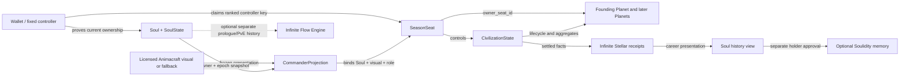

# Infinite Stellar Product Requirements

## Document control

| Field | Value |
| --- | --- |
| Product | Infinite Stellar |
| Document version | 0.2 |
| Status | P0 engineering foundation plus player vertical slice / pre-production |
| Target network | Sui testnet before any mainnet release |
| Product authority | This document plus the accepted decision log |
| Implementation status | Tested Move foundation, typed SDK, runnable local player vertical slice, and sealed Sui testnet interface canary; no production Soul/proof integration or live ranked flow |

This PRD defines the first complete player product. [Onboarding and Narrative Flow](11-onboarding-and-narrative-flow.md) is normative for official-client routes, screens, copy boundaries, and interaction acceptance, but cannot override this PRD or an accepted decision. Detailed game constants belong in a versioned season rules specification; protocol and security details belong in the linked architecture documents.

## Product statement

Infinite Stellar is a seasonal, hidden-information strategy game in which an address authorizes one owned Soul to enter, a Commander Projection binds its visual expression to a fixed seasonal role, a Season Seat controls a temporary civilization and its Planets, hidden-geometry actions are proven on Sui, and the Soul leaves the finished season with verifiable history but no permanent ranked power.

The product promise is:

> One Soul. Infinite worlds. Verifiable history.

## Problem

Soul ownership currently creates identity and provenance, but identity becomes more meaningful when it has lived through consequential experiences. Conventional NFT games often solve this with permanent stats or purchased power, which compounds inequality and turns the identity asset into a balance problem.

Infinite Stellar instead separates continuity from power:

- the Soul remembers;
- Animacraft gives visible form;
- the Commander Projection binds the seasonal role;
- the Season Seat controls;
- the civilization competes;
- the universe resets.

The game must make this distinction understandable without requiring players to understand Move objects, zero-knowledge terminology, or ownership epochs.

## Goals

1. Give an existing Soul a recognizable, persistent role across seasonal worlds.
2. Create strategic tension through private discovery, delayed movement, incomplete information, and social coordination.
3. Make every outcome-changing rule independently verifiable from Sui state.
4. Hide coordinate preimages from required infrastructure.
5. Preserve ranked equality between old, new, expensive, inexpensive, elaborate, and simple Souls.
6. Make wallet, gas, proof, recovery, and settlement flows usable from a web client.
7. Produce factual season records that remain meaningful after the civilization disappears.

## Non-goals for the first public season

- A fungible game token, yield loop, or land sale.
- Tradable fleets, energy, score, or ranked advantage.
- Permanent combat, economy, proof-speed, or map bonuses.
- A protocol-enforced alliance or guild-governance system.
- Permissionless executable plugins.
- A mixed human-and-agent ranked league.
- User-authored universes.
- A complex crafting or technology tree.
- Automatic AI-authored Soul memory.
- Soul minting, Personal Kiosk creation, or Animacraft authoring inside the game.
- A port or fork of Dark Forest.

## Target users

### Primary

- Existing Soul holders who want their Soul to accumulate meaningful life events.
- Strategy players who enjoy uncertainty, logistics, diplomacy, and asynchronous conflict.
- Fully onchain game players who value verifiable rules and composable public history.

### Secondary

- Developers building read-only analytics, alternate presentation shells, or simulations.
- Communities organizing expeditions and seasonal narratives.

### Deferred

- Mobile-only players on low-memory devices.
- High-frequency autonomous agents.
- Users seeking passive financial return.

## Product model

The core multiplayer universe and guest tutorial use dedicated Infinite Stellar product surfaces. The normative screen, route, copy, failure, privacy, and accessibility contracts are in [Onboarding and Narrative Flow](11-onboarding-and-narrative-flow.md). Infinite Flow Engine may later host a separate Soul-bound prologue or PvE Scene. Current Infinite Flow requires a canonical Soul/profile and writes persistent independent Run history, so it cannot serve the guest, resettable, career-history-free tutorial and never becomes the multiplayer Season, Planet, or Arrival authority.

## Core user journey

### A. Tutorial

1. A guest or Soul holder enters an isolated, resettable tutorial before creating a ranked Season Seat.
2. The tutorial teaches local discovery, map secrecy, claiming, movement, arrival, combat, and settlement.
3. The tutorial locally simulates preview, submission, checkpoint finality, and failure; it creates no real transaction. Sponsorship begins in ranked onboarding and bounded initial play.
4. Target completion time is 8–12 minutes.
5. The tutorial creates no ranked history and grants no strategic advantage.
6. The tutorial is game-local and does not create an Infinite Flow profile, Run, Receipt, or Outcome.
7. The official client recommends it to first-time players; an eligible Soul holder may connect a wallet and skip only after acknowledging map privacy, transfer, and recovery disclosures.

### B. Ranked entry

1. The user connects a supported wallet.
2. The client resolves a deterministic fixed-controller Seat and manifest-pinned capacity for the current ranked scope before scanning Souls. An existing Seat routes directly by lifecycle, including after the bound Soul transfers.
3. If no Seat exists and enrollment is open with capacity, the client distinguishes no supported Soul, ineligible Soul, one eligible Soul, and multiple eligible Souls; a full season routes to observation/history without consuming a claim.
4. The user explicitly selects one eligible Soul; the client explains that it supplies identity, not ranked power.
5. The user selects licensed public Animacraft visual material or a neutral fallback.
6. The user selects one manifest-defined seasonal doctrine/build from the same budget available to every ranked Seat.
7. The client displays the exact visual snapshot, public exposure, doctrine, controller and Soul slot effects, season rules, transfer behavior, and map-vault recovery warning.
8. One atomic transaction derives the controller from `ctx.sender()`, consumes controller/Soul/commander uniqueness claims, and creates one Season Seat, one Commander Projection, and one `AwaitingHome` Civilization without a Planet.
9. The finalized commander waits in the sealed-universe lobby only until opening finality publishes the seed, then may prepare locally while waiting for the separate claim gate.

### C. First action

1. At `HomeSearchAvailableAt`, the client creates, unlocks, or verifies the map vault for the exact network, package, season, Seat, and controller.
2. The client searches locally for a valid home region and creates a witness and proof without sending coordinate preimages to required services. This local work remains available after the seed is final even if onchain claims are paused or not yet open. The reference client may warm code and assets from a verified pre-final effect but destroys any speculative candidate, witness, or proof before authoritative search.
3. Before submission, it durably encrypts the pending coordinate, salt, commitment, derivation version, and transaction state.
4. At `HomeClaimAvailableAt`, the user previews the saved candidate and signs or approves a sponsored transaction; otherwise the client keeps it local and explains the gate.
5. The client shows submitted, checkpoint-finalized, indexed, aborted, and safely retryable states separately.
6. Finalized `claim_home` creates the Seat-owned Founding Planet and atomically changes the Civilization from `AwaitingHome` to `Active`.

### D. Seasonal play

1. Discover candidate planets locally.
2. Grow energy and choose between safety, expansion, reinforcement, and attack.
3. Construct a proof-bound route and send an arrival.
4. Observe public commitments and settled results.
5. Coordinate socially, share selected information, bluff, or remain silent.
6. Contest the Last Light objective during the final phase.

### E. Settlement and return

1. The season reaches its declared end.
2. Bounded pending work is settled under the manifest.
3. The package finalizes a winner or no-winner result.
4. The game freezes Seat and valid Soul-segment records.
5. The holder reviews a derived Chronicle separately from factual Echoes.
6. The next season begins with no carried planets, resources, map, fleet, score, or ranked modifier.

## Functional requirements

Priority uses **P0** for the first complete public testnet product, **P1** for the next bounded release, and **P2** for later exploration.

### Identity and authorization

| ID | Priority | Requirement | Acceptance evidence |
| --- | --- | --- | --- |
| ID-001 | P0 | Enrollment validates the canonical Soul package/interface, `SoulState` ID, Soul ID, current owner, current `ownership_epoch`, and `!is_listed` | A forged ID, copied owner, stale epoch, listed Soul, or unsupported package aborts before any ranked uniqueness claim is consumed |
| ID-002 | P0 | One Soul can consume at most one ranked Soul slot per season; one Seat can consume at most one ranked commander slot | Adversarial programmable transactions cannot create a second binding |
| ID-003 | P0 | Strategic control belongs to a fixed Season Seat controller, not to general Soul grants | A valid Soul grant cannot move, spend, or settle game state |
| ID-004 | P0 | Every Soul-attributed update revalidates the live owner and epoch | A market transfer invalidates later attribution without a keeper |
| ID-005 | P0 | A Soul transfer never transfers the Season Seat, civilization, map, score, or command authority | Buyer and seller flows match the normative transfer matrix below |
| ID-006 | P0 | One controller address can create at most one ranked Season Seat per league and season; enrollment derives the controller only from `ctx.sender()` and atomically consumes the logical `ControllerLeagueSeasonSlot` | Concurrent, multi-call, sponsored, and abort-injected transactions yield at most one deterministic controller Seat and no partial slot consumption; two addresses can still enroll, making the address-level limit explicit |
| ID-007 | P0 | Enrollment atomically increments bounded capacity, consumes controller, Soul, and commander claims, and creates the Seat, Commander Projection, attribution accumulator, ScoreCard, Seat-bound non-transferable unused home state, and `CivilizationState(status = AwaitingHome)` but no Planet | Every injected abort, including after capacity mutation, leaves capacity/claims/objects unchanged; cross-Seat substitution fails; a successful enrollment has exactly the complete object set |
| ID-008 | P0 | The manifest pins `max_ranked_seats` and one bounded enrollment-only capacity object; `created_count` can never exceed the cap | The final-slot race yields one success, losers receive `ESeasonFull` with no partial effects, and 100–300 entrant load remains acceptable without adding a global ordinary-play write |
| ID-009 | P1 | Open Agent League uses a separate narrow, expiring, rate-limited command capability | Capability cannot access Soul custody or act outside its mask/term |

#### Normative Soul listing and transfer matrix

| Event | Soul/Projection result | Season Seat and civilization | Buyer/rebinding result | Required product behavior |
| --- | --- | --- | --- | --- |
| Current owner enrolls an unlisted eligible Soul | Binding becomes active and snapshots owner/epoch | Fresh fixed-controller Seat starts in `AwaitingHome` | Controller, Soul, and Seat commander claims are consumed for the ranked scope | Show transfer, controller-key, and no-reuse rules before signature |
| Soul is already listed before enrollment | No binding is created | No Seat or ranked uniqueness claim is consumed | Owner may retry after cancelling the listing | Fail before any partial state and link to listing status |
| Bound Soul is listed after enrollment | Listing alone does not rotate owner/epoch, so attribution remains live | Existing controller and civilization continue | Prospective buyer should receive prominent active-season status | Infinite Stellar warns before every market deep link and calls an integration supported only if it shows the warning before purchase; unsupported external markets are disclosed and remain outside UI control |
| Listing is cancelled without purchase | No identity or epoch change | No change | No new binding is available because the existing seasonal slots remain consumed | Remove listing warning after canonical readback |
| Supported purchase rotates owner and epoch | Old projection fails the live predicate immediately and presents neutral fallback | Seller's fixed controller, civilization, map, score, and sanctions remain unchanged | Buyer receives Soul and public history only; the consumed `SoulSeasonSlot` prevents ranked rebinding until next season | Materialize `DetachedByTransfer` lazily, close attribution segment, and show the boundary |
| Any later call presents the stale owner/epoch | No Soul-attributed counter, relationship, or achievement update is accepted | Pure Seat actions may continue under the fixed controller | Buyer gains no command path | Abort attribution deterministically without relying on an indexer or keeper |
| Season settles after detachment | Seat receipt records the civilization result; Soul-segment receipt contains only previously valid attributed facts | Seat can still settle and rank under published rules | Buyer can view provenance but receives no seller outcome by implication | Label materialization time separately from unknown historical purchase time |

The current protocol does not provide a direct-transfer or external runtime lock that Infinite Stellar can treat as a game primitive. Any future ownership path must rotate the canonical epoch or this matrix must be revised before support.

After connection, the official client resolves the fixed controller's Seat before reading currently owned Souls. The seller resumes that Seat and its Seat-scoped vault under neutral presentation after transfer; the buyer sees Soul history and the consumed Soul slot but receives no command or vault route. Strategic authorization always has a pure Seat path, while Soul attribution is an additional live predicate.

### Seasonal doctrine

| ID | Priority | Requirement | Acceptance evidence |
| --- | --- | --- | --- |
| DOC-001 | P0 | The manifest defines the full doctrine/build option set and one equal budget available to every ranked Seat | Every accepted build is reproducible from the manifest and fits the same published budget rule |
| DOC-002 | P0 | Doctrine selection is independent of Soul, projection, price, history, and wallet wealth; it is frozen at enrollment and resets after settlement | All eligible Seats can select every option, post-enrollment mutation aborts, and a later season starts without inherited effects |
| DOC-003 | P0 | Doctrine effects enter the same canonical math/vector suites as other ranked constants | TypeScript, Circom where relevant, Rust, and Move agree on every doctrine-dependent vector |

Exact doctrine names and constants remain a season-rules decision. The game may omit functional doctrine variation only by publishing one identical default build for every Seat; it may not silently derive a build from Soul or Animacraft traits.

### Projection and presentation

| ID | Priority | Requirement | Acceptance evidence |
| --- | --- | --- | --- |
| VIS-001 | P0 | `CommanderProjection` freezes the Soul/visual/ownership-epoch/role/Seat binding, including manifest `Commander` role-schema ID, approved Animacraft visual reference or neutral fallback, content version, commitment/hash, and display-license reference | Historical role and its applicable presentation permission resolve deterministically or use fallback; an Animacraft artifact alone grants no game authority |
| VIS-002 | P0 | Projection traits and provenance never enter ranked combat, economy, proof, sponsorship, or scoring math | Static analysis and tests show no ranked read of visual attributes |
| VIS-003 | P0 | Non-neutral display requires a versioned license schema and authority proof covering render mode, modification/animation, commercial scope, term, and historical/post-transfer use | Provenance-only, empty-terms, expired, wrong-subject, and unauthorized licenses select the neutral fallback |
| VIS-004 | P0 | Season 0 remains playable without protected-asset decryption | Every journey passes using licensed public assets or the neutral fallback |
| VIS-005 | P1 | Eligible cosmetic Echoes may be rendered or issued after settlement | Cosmetic output carries receipt/render/license provenance and no ranked effect |

### Universe and privacy

| ID | Priority | Requirement | Acceptance evidence |
| --- | --- | --- | --- |
| UNI-001 | P0 | Enrollment closes before a one-way, permissionless Sui Random transition samples the universe seed | Caller cannot retry, reject, or choose among seeds |
| UNI-002 | P0 | Planet generation is deterministic across TypeScript, Circom, Rust, and Move | One versioned golden-vector corpus passes in every implementation |
| UNI-003 | P0 | Coordinate search, preimages, salts, annotations, and route witnesses remain local by default | Full-flow network capture contains no private coordinate material |
| UNI-004 | P0 | The user can export, encrypt, restore, and verify a vault authenticated to network, engine package, season, Seat, controller, schema, and cryptographic parameters | Clean-profile recovery restores a playable map; missing, locked, corrupt, incompatible, and wrong-namespace inputs remain distinct and never overwrite valid data |
| UNI-005 | P0 | Discovering a coordinate does not itself grant ownership; every owned Planet records `owner_seat_id`, never Soul ID or current Soul owner | Only a valid home claim or settled colonization arrival changes Seat control, including after Soul transfer |
| UNI-006 | P0 | The manifest guarantees `minimum_home_claim_window_ms` of cumulative onchain-evidenced, unpaused claimable time through a permissionless capped availability tick; delayed opening, pause, or an unevidenced chain/ticker gap cannot silently become player-caused missed activation | Manifest validation, delayed-opening, pause/outage-through-close, long-tick-gap, capped extension, passed-close, same-checkpoint resume/claim, and operator-absent tests leave credited minimum availability or permissionless `HomeWindowUnavailable` cancellation |
| UNI-007 | P0 | A nonzero manifest-pinned `seed_observation_delay_ms` makes `home_claim_not_before_at = max(effective_home_claim_open_at, universe_opened_at + seed_observation_delay_ms)` and rejects an immediate claim | Pre-final speculation is labeled noncanonical; exact-before/at/after-delay, same-checkpoint multi-commit, and custom-client parity tests pass without claiming checkpoint separation |

### Proofs and actions

| ID | Priority | Requirement | Acceptance evidence |
| --- | --- | --- | --- |
| ZK-001 | P0 | Hidden-geometry actions prove valid endpoints, bounds, and route constraints without revealing coordinates | Valid vectors pass; coordinate preimages are absent from public inputs |
| ZK-002 | P0 | Proof intent binds season, rules, Seat/controller, action kind, endpoints, action-specific proof amount, nonce, and deadline; for interface-v1 `move`, that amount is maximum route distance while energy/silver remain live-state arguments | Mutating any bound field makes verification or action validation fail |
| ZK-003 | P0 | The production circuit fits the active Sui Groth16 public-signal limit | Pinned Sui version and integration test prove supported verification |
| ZK-004 | P0 | Client and contract reject unpinned proving artifacts and verifying keys | Artifact mutation and wrong-circuit tests fail closed |
| ACT-001 | P0 | From `AwaitingHome`, the user can claim one Seat-owned Founding Planet and become `Active`, then create/target a Planet, dispatch energy, reinforce, attack, and settle arrivals | End-to-end tests cover every lifecycle state, unique home claim, `owner_seat_id`, and exact boundary |
| ACT-002 | P0 | Energy growth, travel decay, defense, combat ties, and arrival order are deterministic and bounded | Golden vectors and property tests cover rounding and limits |
| ACT-003 | P0 | Ordinary actions do not require a mutable universe-wide object | Load trace shows natural contention only at touched shards/planets |
| ACT-004 | P0 | Arrival collections and settlement work are bounded | Worst-case gas remains within the declared queue cap |

### Elimination and recovery

| ID | Priority | Requirement | Acceptance evidence |
| --- | --- | --- | --- |
| ELIM-001 | P0 | `CivilizationState` deterministically distinguishes AwaitingHome, Active, AtRisk, RecoveryEligible, Eliminated, Settled, and Cancelled | Home/ownership/arrival vectors reproduce every transition without an indexer scan |
| ELIM-002 | P0 | A previously activated Seat becomes RecoveryEligible only when it controls no Planet, has no qualifying capture arrival, has an unused recovery, and is before effective `recovery_close`; `AwaitingHome` is categorically excluded | Exact-boundary, pre-home, vault-loss, and stale-state tests reject every ineligible recovery |
| ELIM-003 | P0 | Each Seat can consume at most one `RecoverySlot` to prove and claim a valid unclaimed low-level recovery planet under a separate domain | Concurrent/replayed claims cannot create a second recovery or duplicate planet |
| ELIM-004 | P0 | Recovery energy never exceeds the initial budget and recovery grants no repeated home/claim score | Math and ScoreCard vectors cover recovery and later recapture |
| ELIM-005 | P0 | Eliminated players cannot create strategic actions but can observe, export, use social surfaces, and settle | End-to-end elimination journey remains usable through season settlement |
| ELIM-006 | P0 | An `AwaitingHome` Seat can only claim its initial home or follow the home-window resolution/cancellation path; at effective close the permissionless resolver chooses `Eliminated(HomeNotEstablished)` only after the minimum cumulative onchain-evidenced claimable window, otherwise global `Cancelled(HomeWindowUnavailable)` | Before/open/exact-close/after-close, repeated-pause, long-tick/outage-gap, operator-absent, elimination, refund, and cancelled-season tests agree across Move, client, and indexer |
| ELIM-007 | P0 | After effective home close, every strategic action, settlement start, and receipt finalization across all Seats atomically invokes or requires global `home_window_resolution != Pending`; an Active Seat cannot precede a later universe-wide cancellation | Active-first and AwaitingHome-first orderings at sufficient and insufficient credit yield the same global resolution before any action or receipt freezes |

### Social play and endgame

| ID | Priority | Requirement | Acceptance evidence |
| --- | --- | --- | --- |
| SOC-001 | P0 | Players can share selected coordinates or plans through an explicitly non-authoritative social surface | Sharing never uploads the entire vault and can be disabled |
| SOC-002 | P0 | The UI distinguishes social promises from enforced protocol commitments | No unenforced promise is labeled guaranteed |
| SOC-003 | P0 | Minimum reinforcement, rescue, and joint-Last-Light relationship records cite both Souls, epochs, Seats, season, action digest, and reciprocal status where claimed | Closed Alpha evidence rebuilds from checkpoints and transfer provenance remains visible |
| SOC-004 | P1 | The career view aggregates repeated cross-season relationships without converting them into moral traits or ranked reputation | Derived labels link to rules/evidence and subjective interpretation requires holder approval |
| END-001 | P0 | Before Beacon entropy is sampled, every location in the committed bounded candidate domain permits at least one legal capture-and-hold path before season end | Permissionless validation exhausts every candidate against activation, reachable source classes, travel time, movement close, hold window, extension, and season end; a failing domain takes the predeclared cancellation/no-winner path before sampling and cannot be replaced or redrawn |
| END-002 | P0 | A fresh one-way random transition activates the Last Light at the declared phase | Operators cannot preselect, retry, or reject the objective |
| END-003 | P0 | Finalization drains only bounded required work and writes winner or no-winner | Any account can finalize after conditions are met |
| END-004 | P0 | ScoreCard state is onchain; exact leaderboard presentation is reproducible from checkpoints | Clean indexer rebuild yields identical eligible order |

### Receipts, memory, and continuity

| ID | Priority | Requirement | Acceptance evidence |
| --- | --- | --- | --- |
| REC-001 | P0 | Settlement creates a frozen `InfiniteStellarSeatReceipt` for the civilization result | Receipt fields match manifest and canonical final state |
| REC-002 | P0 | A frozen `InfiniteStellarSoulSegmentReceipt` includes only facts accumulated while one owner/epoch binding was live | Transfer test prevents post-transfer facts entering the old segment |
| REC-003 | P0 | Receipt accumulators are maintained onchain from fixed leaf encodings; indexers retrieve rather than invent them | Root/accumulator rebuild matches chain state |
| REC-004 | P0 | Factual Echoes and subjective Chronicles are visibly distinct | UX review finds no narrative presented as protocol fact |
| REC-005 | P0 | The official Chronicle flow requires a separate transaction directly signed by the current holder and never uses `SoulGrant` authority | Settlement and a MEMORY grantee alone cannot complete the official Chronicle flow |
| REC-006 | P0 | No private coordinate, salt, alliance secret, or live plan enters transferable memory | Schema denylist and adversarial content tests pass |

### Wallet, transaction, and recovery experience

| ID | Priority | Requirement | Acceptance evidence |
| --- | --- | --- | --- |
| UX-001 | P0 | An eligible `AwaitingHome` Seat reaches a checkpoint-finalized Founding Planet claim within five minutes p50 wall-clock after canonical `HomeSearchAvailableAt`; tutorial and sealed waiting are separate, while claim-gate delays and operational incidents remain visible | Ordered checkpoint effects and usability sessions meet the cohort definition below; pauses are never subtracted to improve latency |
| UX-002 | P0 | Sponsored transactions hide gas acquisition during ranked onboarding and bounded initial play; the no-wallet tutorial uses labeled local simulation instead of a hidden signer | New-wallet test reaches ranked play without prior SUI, and tutorial network capture contains no transaction submission |
| UX-003 | P0 | Every action shows meaningful preview, pending, finalized, indexed, rejected, retry, and recovery states | Failure-injection tests cover wallet, sponsor, proof, chain, and indexer errors |
| UX-004 | P0 | The player can distinguish authoritative chain state from stale indexer/UI state | Important results link to checkpoint or transaction evidence |
| UX-005 | P0 | Client updates do not silently change ranked transaction or proof semantics mid-season | Manifest-compatible presentation releases are hash-pinned and disclosed |
| UX-006 | P0 | Seat-first routing and no-Soul, ineligible, one-Soul, multiple-Soul, returning, wrong-wallet, seller/controller, buyer/current-holder, and enrollment-closed branches are distinct and actionable | Screen/state matrix and direct-chain fallback tests cover every branch without relying on indexer authority |
| UX-007 | P0 | The client encrypts pending home/recovery secrets before submission and reconciles only by exact digest/effects or commitment-derived Planet match | Crash injection and concurrent candidate A/B tests preserve records, never finalize the wrong secret, and surface a missing winning secret |
| UX-008 | P0 | Vault restore, gameplay `recover_home`, and future controller recovery use distinct terms and permissions | Content review and failure tests cannot turn vault loss into another home or a gameplay recovery claim |
| UX-009 | P0 | `AtRisk` and `RecoveryEligible` expose complete settlement, local discovery, encrypted persistence, proof, deadline, conflict, finality, and elimination routes | Gameplay-recovery end-to-end suite covers every state and exact `recovery_close` boundary |
| UX-010 | P0 | Tutorial skip and enrollment require versioned explicit acknowledgement of controller loss, Soul transfer, public correlation, and vault loss; first claim requires completed backup or explicit local-loss acceptance | Consent-state tests keep actions disabled until the relevant acknowledgement and never mislabel consent as a protocol waiver |

### Operational transitions

| ID | Priority | Requirement | Acceptance evidence |
| --- | --- | --- | --- |
| OPS-001 | P0 | The manifest freezes pause, extension, cancellation, refund/receipt, and allowed-cause policies before enrollment | No operational capability can exceed a listed transition, cause, window, or bound |
| OPS-002 | P0 | Pause blocks new strategic actions while preserving explicitly safe read, export, bounded settlement, withdrawal/refund where applicable, and finalization paths | Permission tests enumerate every call during pause; forbidden actions abort before mutation |
| OPS-003 | P0 | Extension is one-way, allowed only for a manifest-listed objective availability failure within its call window, and cannot exceed total `max_extension_ms` | Unauthorized cause, late call, decrement, overflow, invalid suffix, and over-cap tests fail |
| OPS-004 | P0 | Each extension cause maps to a manifest-declared suffix of future phase boundaries; all phase checks derive an effective timestamp from the frozen base plus that phase's monotonic offset | The same delta reaches every boundary in the allowed suffix, preserves ordering, and agrees across Move, client, indexer, and manifest validator |
| OPS-005 | P0 | A phase boundary whose current effective time has arrived or whose one-way transition has committed is immutable and never reopens; an extension must execute strictly before the earliest boundary it affects | Exact-boundary tests after universe opening, home-claim opening/closing, recovery close, Beacon activation, and movement close reject changes to completed phases while permitting only a separately authorized later suffix |
| OPS-006 | P0 | Cancellation is irreversible, records an allowed reason, prevents a winner from being invented, and applies the predeclared refund and participation-receipt policy | Repeated, late, or unauthorized cancellation fails; cancelled/no-winner UI and receipts match chain state |
| OPS-007 | P0 | Every operational transition is visible through onchain evidence and a player-readable status/history surface | Failure-injection rehearsal covers pause, resume, maximum extension, cancellation, recovery, and settlement |
| OPS-008 | P0 | Runtime stores a bounded availability last-tick time and credited-claimable accumulator; `0 < max_home_availability_tick_gap_ms < minimum_home_claim_window_ms`, permissionless ticks credit at most that gap within the open, unpaused half-open window, and close resolves to missed activation only after the minimum, otherwise irreversible `HomeWindowUnavailable` cancellation | Invalid manifest bounds, repeated-pause, long checkpoint/ticker gap, currently-paused, exact-close, cap-exhausted, and no-operator vectors require no event scan and leave no non-terminal deadlock |
| OPS-009 | P0 | `PauseCap` can toggle pause and settle availability but cannot extend time; only `ExtensionCap` may compensate a legal future suffix, and home-window compensation adds only the exact remaining delta after unused slack while other causes use their own manifest-frozen objective bounds | Pause-only, home-window and post-movement extension, atomic extend/resume, excess-delta, late-boundary, cap-exhausted, and cancellation-fallback tests preserve capability separation |

## Chain and local-data boundary

| Authoritative on Sui | Private/local or replaceable |
| --- | --- |
| Soul identity references and live ownership predicate | Coordinate preimages and salts |
| Season manifest, rules, phases, and operational limits | Search process and private annotations |
| Seats, projections, civilization public state | Encrypted map graph and selected social secrets |
| Location commitments and proof-backed actions | Route previews and local simulations |
| Seat-owned Planets (`owner_seat_id`), energy, arrivals, combat, and ScoreCards | Rendering, animation, audio, and cached projections |
| Last Light activation and final result | Non-authoritative chat and social coordination |
| Receipt accumulators and frozen settlement records | AI-assisted Chronicle drafts |

An indexer, sponsor, CDN, analytics service, or official client may improve access but cannot become the only source of an outcome-changing fact.

## Non-functional requirements

### Correctness

- All consensus-adjacent math uses explicit integer or fixed-point semantics.
- Cross-language encodings have rejection rules and golden vectors.
- Every collection on a state-transition path has a declared bound.
- Season phase boundaries are tested at exact timestamps.
- Settlement is deterministic and permissionless wherever safe.

### Performance

| Measure | Initial threshold |
| --- | --- |
| Desktop proof p95 | At most 5 seconds on declared reference hardware |
| Default desktop hard-stop threshold | Redesign if above 10 seconds |
| Peak prover memory | At most 512 MB on reference hardware |
| Submitted transaction success | At least 99%, excluding explicit valid rule rejection |
| Indexer recovery | Clean rebuild reaches the same public projection |
| Global action topology | No universe-wide mutable write on ordinary paths |

Every benchmark records device, browser, Sui version, circuit hash, package revision, dataset, and command.

### Privacy

- Enumerated analytics schemas only; arbitrary context objects are prohibited.
- No session replay on map, proof, recovery, or coordinate-sharing surfaces.
- Worker messages, storage snapshots, transaction payloads, and crash reports are scrubbed.
- Third-party code receives no map-vault or wallet-signing capability by default.
- Soul/wallet/Seat correlation is disclosed; hidden coordinates do not imply anonymity.

### Accessibility and clarity

- Critical map states are not communicated by color alone.
- Motion and sound have reduced-motion and mute-safe equivalents.
- Transaction, proof, and recovery errors use player language before technical detail.
- Every permanent record explains whether it is fact, derivation, or holder-approved narrative.
- A synchronized Tactical List exposes every essential map fact and action as structured text with keyboard and screen-reader operation; spatial position is never the only representation.

### Operability

- Package, circuit, client-core, rules, and manifest builds are reproducible.
- RPC/provider failover and clean indexer rebuild are rehearsed.
- Pause, bounded extension, cancellation, and settlement policies are published before entry.
- Operators cannot improvise a winner or mid-season balance change.

## Product surfaces

P0 includes:

1. Landing and season status.
2. No-wallet, no-ranked-or-career-history tutorial.
3. Wallet connection and Seat-first route resolution.
4. Existing-Seat resume and detached seller/buyer/wrong-wallet status.
5. No-Soul and ineligibility guidance plus one/multiple-Soul selector.
6. Visual selector with provenance, license, and fallback preview.
7. Equal-budget seasonal doctrine selector.
8. Season rules, fixed-controller/transfer disclosure, and final enrollment review.
9. Sealed-universe lobby and canonical home-availability state.
10. Seat-scoped vault create/unlock/backup/restore/health surface.
11. Local home search, pending-secret persistence, proof progress, and Founding Planet claim.
12. Private stellar map.
13. Planet and arrival inspector.
14. Action composer and proof progress.
15. Activity, transaction, and gameplay-recovery log.
16. At-risk arrival settlement and proof-bound gameplay-recovery surface.
17. Last Light and season timeline.
18. Public leaderboard and evidence view.
19. Settlement, Echo, and optional Chronicle review.

Marketplace, long-form Soul profile, and Animacraft authoring remain their respective products. Infinite Stellar links to them but does not duplicate them.

## Measurement

### North-star metric

Share of source-season eligible controllers who complete at least three meaningful strategic interactions and then create a valid Seat and finalize one ranked action in the next comparable Human League season. The denominator is every eligible controller in the non-cancelled source season.

A meaningful interaction is a state-changing action involving another Seat or contested objective, such as combat, reinforcement, rescue, coordinated Last Light contribution, or an accepted reciprocal relationship. Self-transfers and spam do not count.

### Initial learning thresholds

| Area | Threshold |
| --- | --- |
| Home search available to finalized Founding Planet | Under 5 minutes p50 wall-clock; incident-affected cohorts separate |
| Guest tutorial completion time | 8–12 minutes target range |
| First-session tutorial plus Founding Planet claim | Under 20 minutes p50 |
| Tutorial completion | At least 60% |
| Day-1 retention | At least 30% |
| Day-7 retention | At least 15% |
| Return for next season | At least 25% |
| Social/competitive participation | At least 40% complete one meaningful event |
| Client privacy | Zero coordinate values in logs, analytics, crash reports, or replay tools |

Canonical metrics may be segmented by public season, league, density, and aggregate new/returning checkpoint cohorts. Consented client-performance studies may separately aggregate coarse wallet type, device class, and proof-latency buckets, but those records are never joined to wallet, Soul, Seat, transaction, or canonical funnel rows. No metric collection may violate the privacy boundary to improve observability.

### Metric event and cohort definitions

- **Eligible controller:** the unique fixed controller address of one valid ranked Season Seat in the league and season. The protocol permits at most one such Seat for that scope. Internal load-test, operator, sanctioned, and explicitly unranked Seats are excluded by a published allow/deny policy. This address cohort is not a human-unique or Sybil-resistant cohort.
- **First-ranked-action cohort:** eligible controllers with at least one checkpoint-finalized ranked strategic action, anchored at that controller's `first_ranked_action_at`. Ranked activation is this cohort divided by all eligible controllers after the season closes; Seat creators who never act remain visible as activation churn rather than disappearing from every denominator.
- **Ordered availability anchors:** each anchor is represented by checkpoint sequence, transaction/effects ordinal, and canonical onchain Clock time and evaluates the Seat's pre-claim lifecycle. Opening or resume and a causally later claim may share a checkpoint; recorded Clock time and ordinal preserve elapsed time and order, and checkpoint-end `Active` state does not erase the anchor.
- **Home-search availability:** `HomeSearchAvailableAt` is the ordered finalized universe-opening effect at which the seed first exists for the finalized `AwaitingHome` Seat. Authoritative local mining and proof preparation are possible from this point even if `claim_home` is paused or not yet open; pre-final work is explicitly speculative.
- **Home-claim availability:** `home_claim_not_before_at` is `max(effective_home_claim_open_at, universe_opened_at + seed_observation_delay_ms)`. `HomeClaimAvailableAt` is the first ordered finalized effect at or after search availability where that boundary has arrived, effective `home_claim_close_at` has not arrived, and the claim path is neither paused nor cancelled. It measures the onchain gate, not the start of all local work. Neither anchor is a client clock, indexer observation, or Seat-creation event.
- **First finalized Founding Planet claim:** the first causally ordered, checkpoint-finalized successful `claim_home` for that Seat. The five-minute activation metric is wall-clock from `HomeSearchAvailableAt`; the reference client and release benchmark reuse no pre-final candidate/proof, so it includes all authoritative search, encrypted pending-secret persistence, proof, gating, preview, signing, sponsorship, execution, and finality. Wallet installation, optional tutorial, worker/asset warm-up, and sealed-universe waiting are excluded. Pause and other operational incidents are labeled and reported separately but never subtracted or silently dropped to improve latency; completion rate, never-activated churn, and the custom-client speculative-compute limitation accompany the p50.
- **Tutorial start and linkage:** the client emits `TutorialStarted` at the first interactive lesson with a random, attempt-scoped identifier. Restarts within 24 hours reuse that identifier; it rotates after completion or expiry and is never joined to a wallet, Soul, Seat, coordinate, map vault, or ranked analytics profile. QA, operator, bot, and load-test attempts are excluded by a published test policy.
- **Tutorial completion:** `TutorialCompleted` uses the same attempt identifier after the player finishes privacy, claim, move, arrival, combat, and settlement lessons. Completion rate is distinct completed attempts within 24 hours divided by distinct valid starts whose 24-hour observation window is complete. Restarts neither add a start nor a completion.
- **Tutorial completion time:** client-measured active foreground time from `TutorialStarted` to `TutorialCompleted`; the 8–12 minute target is reported as a median with p25/p75 and completion count.
- **First-session combined time:** measured only in an explicitly consented usability cohort from first tutorial interaction to checkpoint-finalized Founding Planet claim. The collector receives a duration bucket and completion flag, not a persistent tutorial-to-wallet, Soul, or Seat mapping.
- **Meaningful interaction:** one unique finalized action digest in an allowed category involving another Seat or the contested Last Light. Repeated self-actions, failed transactions, reciprocal spam, and duplicate digests do not count.
- **Social/competitive participation:** eligible controllers with at least one meaningful interaction divided by all eligible controllers after a non-cancelled season settles.
- **Day-1 retention:** first-ranked-action cohort members with another valid ranked action from hour 24 through hour 48 after `first_ranked_action_at`, divided by cohort members whose full 48-hour window ends no later than effective season settlement.
- **Day-7 retention:** first-ranked-action cohort members with another valid ranked action from hour 144 through the earlier of hour 192 or effective settlement after `first_ranked_action_at`, divided by cohort members whose window opens before settlement and whose resulting window has closed. Members whose window never opens are reported as censored, not silently included or excluded.
- **Next-season return:** source-season eligible controllers who create a valid Seat and finalize one ranked action in the next comparable Human League season, divided by all source-season eligible controllers once the target observation window closes. The denominator is frozen before the target season and includes non-returners, including controllers who no longer hold an eligible Soul; continued eligibility may be reported only as a separate segment.
- **Cancelled seasons:** reported separately and excluded from retention and return release gates; their enrollment, incident, support, and refund metrics remain public.

All rates use fixed season cohorts and denominators. Acquisition growth cannot turn a declining cohort rate into a passing release gate.

## Release slices

### Technical go/no-go

Three weeks. Prove or reject the circuit, object topology, cross-language math, browser proving, gas bounds, contention behavior, indexer rebuild, and coordinate privacy assumptions.

### Vertical slice

Ten internal players complete a 60-minute universe with Seat-first routing, every Soul eligibility branch, projection snapshot, atomic `AwaitingHome` enrollment, crash-safe Founding Planet claim, movement, combat, transfer resume, settlement, receipts, and map recovery.

### Closed Alpha

50–150 invited players complete a seven-day season with the Last Light, support, incident drills, relationship evidence, and full privacy-safe observability.

### Open testnet

100–300 active players per universe validate acquisition, retention, abuse resistance, world density, sponsorship, and operating independence.

### Bounded mainnet

Only after independent Move and circuit audits, trusted setup, reproducible artifacts, privacy capture, load gates, incident rehearsals, license review, and name clearance.

Brand expansion remains separately blocked: the team has not obtained prior written consent for the current working name. D-023 permits only an unannounced existing-infrastructure testnet/Vercel canary and must not be read as satisfying any public-launch or mainnet gate.

## Dependencies and truth constraints

### Soulidity

Infinite Stellar must pin the exact Soulidity package and interface version. It relies on canonical `SoulState`, current owner, and ownership epoch. It does not assume that structured game Outcomes, relationships, season records, or a runtime transfer lock already exist in Soulidity.

### Animacraft

The product may accept a versioned public projection and provenance commitments after validating an exact supported release. Season 0 always has a neutral fallback and does not depend on protected-decryption availability or unreleased authoring capabilities. Official rendering uses a content-addressed same-origin cache or privacy-preserving proxy without identity-bearing query parameters or third-party referrers.

### Marketplace warning conformance

Infinite Stellar does not control external Soul marketplaces. It exposes machine-readable active-binding status, warns before any market deep link, and labels an integration supported only when its pinned version shows the warning before purchase. Onchain epoch invalidation remains the security boundary even when an unsupported external market omits product copy.

### Infinite Flow Engine

The engine is an optional Soul-bound prologue/PvE integration. Its current experimental status, canonical-Soul requirement, one-profile-per-Soul model, persistent Run history, SoloRun semantics, and release gates remain independent. Any future integration keeps Infinite Flow receipts outside Infinite Stellar ranking, progression, and season receipts. The guest tutorial never depends on it.

### Sui

The production manifest pins the Sui network and relevant protocol/API versions. Claims about Groth16 limits, derived-object behavior, gRPC, GraphQL, randomness, and transaction semantics must be reverified against that target release.

## Launch blockers

The first public testnet is blocked by:

- failure of any technical go/no-go criterion;
- coordinate leakage in required traffic or telemetry;
- inability to restore a map vault;
- duplicate ranked Seats for one controller/league/season or partial enrollment effects;
- capacity overflow, final-slot partial effects, or unacceptable enrollment-only contention;
- zero/invalid seed-observation delay, immediate-claim bypass, loss of same-checkpoint causal/timing data, or an availability accumulator that credits an unbounded chain/ticker gap;
- a route that hides a valid fixed-controller Seat after Soul transfer;
- ambiguous pre-home lifecycle, Planet ownership, or gameplay recovery eligibility;
- loss of a pending/finalized Founding Planet secret across client reload;
- unbounded arrival or settlement work;
- inconsistent cross-language vectors;
- an operator-only path required for normal play or settlement;
- absence of an actionable private security channel;
- misleading Soul, transfer, projection-rights, or narrative disclosures.

Mainnet additionally requires:

- independent Move and circuit audits with no unresolved critical/high findings;
- production trusted setup and reproducible artifact verification;
- package immutability for the active season;
- tested pause, extension, cancellation, recovery, and disclosure runbooks;
- sustainable sponsor and infrastructure cost evidence;
- approved repository/dependency/asset licensing;
- formal product-name and trademark clearance, including any written permission required for the current working brand.

## Open product decisions

- Final visual identity and seasonal art system.
- Exact coordinate hash, circuit, and public-input packing.
- Planet density, region function, and combat constants.
- Arrival-object topology and queue bounds.
- Whether formal alliances ship after Alpha.
- Recovery and delegation beyond a fixed ranked controller.
- Mobile proving scope.
- Production provider and full-node strategy.
- Relationship receipt set and presentation rules.
- Long-term monetization limited to non-ranked expression and services.

Changes that alter the persistent-Soul/ephemeral-civilization model require an explicit decision-log update, not an implementation shortcut.
