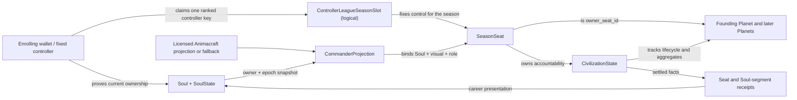
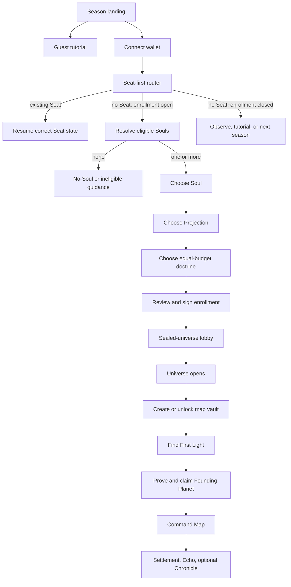
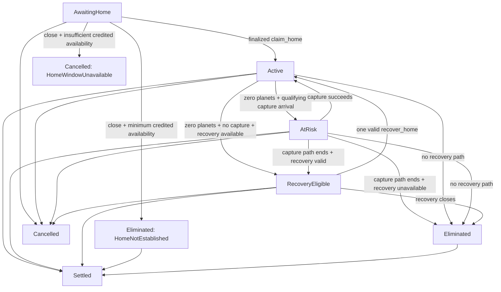

# Onboarding and Narrative Flow

> **Status:** Normative P0 interaction specification for the official client, subordinate to the PRD and accepted decision log. Infinite Stellar remains in pre-production. An experimental Move foundation, sealed Sui testnet interface canary, local player activation vertical slice, and undeployed canonical Soulidity mainnet enrollment adapter exist; no production proof integration or live ranked flow exists yet.

This document defines how a person moves from a public season page to a Soul-bound ranked civilization, how the official client resolves returning and transfer states, and how protocol facts become a coherent story without confusing identity with control.

The shortest rule is:

> Addresses authorize. Souls cross. Animacraft gives form. Commander Projections bind roles. Seats control. Civilizations expand. Universes collapse. Echoes remain.

## Product model

A Soul enters a seasonal universe, not a planet. An accepted Animacraft visual or neutral fallback gives it visible form. The Commander Projection binds that Soul and frozen presentation to a seasonal role, a fixed Season Seat controls the civilization and its Planets, and the first Seat-owned foothold is the Founding Planet.

| Layer | Product meaning | Authority or persistence | Must never imply |
| --- | --- | --- | --- |
| Wallet/address | Command key and transaction signer | Current account session; fixed Seat controller in ranked Alpha | Protagonist, Soul, or transferable empire |
| Soul/SoulState | Persistent traveler, relationship node, and career subject | Cross-season identity; live owner and ownership epoch come from canonical Soulidity state | Planet custody, ranked modifier, or command capability |
| Animacraft visual or fallback | Versioned visual expression used by the seasonal commander | Licensed snapshot or permanent neutral presentation | Authorization, identity, or proof of display rights from provenance alone |
| Commander Projection | Seasonal Soul/visual/role binding | Frozen historical record linking Soul, ownership epoch, presentation, and Seat | Second tradable identity, independent body asset, or equipment power |
| Season Seat | Ranked control, accountability, league, quota, sponsorship, and sanctions | Fixed for one season and league | Soul ownership or transferable map access |
| Civilization | Temporary strategic run | One season; mutable bounded state | Cross-season power or Soul memory |
| Founding Planet | First public command anchor of the civilization | Controlled through `owner_seat_id`; one universe | Permanent Soul home, Soul vessel, or discovery reward |
| Private map vault | Coordinates, salts, routes, labels, and private home record | Local and encrypted under chain, engine package, season, Seat, and controller | Onchain asset, Soul content, or automatic transfer payload |

At enrollment, the connected address, canonical Soul owner, `owner_at_bind`, and fixed Seat controller are the same address. After enrollment they are deliberately independent: a later Soul transfer never changes the Seat controller.

## Route overview

The official client never routes solely from current Soul ownership. It resolves an existing Seat first so that a controller can resume a civilization after its Soul has transferred and detached.

### Screen and mutation matrix

| Surface | Entry predicate | Authoritative reads | Permitted mutation | Normal exit |
| --- | --- | --- | --- | --- |
| Season landing | Public visitor | Manifest, capacity, runtime, checkpoints | None | Tutorial, wallet, observer, or results |
| Guest tutorial | Visitor chooses learning | Tutorial rules only | Isolated tutorial state; no ranked or Soul-linked record | Landing or wallet |
| Seat-first router | Wallet connected | Network, manifest, capacity, controller-derived Seat, owned-Soul slots, lifecycle | None | Existing-Seat destination, Soul history, or eligibility |
| Soul selector | No Seat; enrollment open | Canonical `SoulState`, listing, owner/epoch, Soul/controller claims | Local selection draft only | Visual selection or actionable block |
| Visual and doctrine | Eligible Soul selected | Display-license policy, visual evidence, manifest options | Local enrollment draft only | Final review |
| Enrollment review | Complete valid draft | All enrollment inputs and current chain state | One atomic enrollment transaction only after approval | Finalized lobby or explicit failure |
| Sealed lobby | Finalized `AwaitingHome`; universe sealed | Seat, binding, manifest, runtime | Permissionless universe-opening transaction when due; local notifications | First Light after opening finality |
| Find First Light | `AwaitingHome`; seed public | Runtime, home state, registry inputs, vault namespace | Encrypted local candidates and proof artifacts; claim only when available | Saved candidate, claim preview, or status route |
| Founding claim | Saved candidate and valid proof | Lifecycle, claim slot, registry/Planet uniqueness, phase | One atomic `claim_home`; local pending status | Active Command Map or safe retry |
| Command Map | Existing non-terminal strategic Seat | Seat, lifecycle, Planets, arrivals, score, runtime, vault health | Previewed proof-bound Seat actions | Updated map, recovery, or settlement |
| Gameplay recovery | `RecoveryEligible` | Seat, lifecycle, recovery slot/domain/deadline, registry, vault | Saved recovery candidate and one proof-bound `recover_home` | `Active`, safe retry, or `Eliminated` |
| Eliminated status | Eliminated but not settled | Seat, lifecycle, runtime, public evidence | Local export only | Settlement or settled results |
| Cancellation status | Cancelled | Runtime reason, refund/receipt policy, public evidence | Manifest-permitted refund and local export only | Terminal evidence view |
| Results and Chronicle | Settled with frozen receipts | Receipts, evidence, current Soul holder for optional memory | Separate directly holder-signed Chronicle only | Career view or next season |

No selection screen writes onchain. No chain mutation is presented as final before checkpoint finality. Local vault mutations and onchain mutations are reconciled explicitly because they cannot be atomic with each other.

## End-to-end screen contract

### 1. Season landing — The Threshold

The public landing surface works without a wallet. It displays the network, league, enrollment state, effective phase times, Seat cap, rules hash, current operational status, and whether the universe is sealed, live, settling, cancelled, or complete.

Primary actions:

- `Enter This Season` while enrollment is open and capacity remains.
- `Learn in 8–12 Minutes` for the isolated guest tutorial.
- `Observe Universe` when public state exists.
- `View Results` after settlement.

Canonical copy:

> One Soul. One temporary civilization. No carried power.

The product must not ask for wallet access merely to read public season information or start the guest tutorial.

### 2. Guest tutorial — Learn without ranked identity

The tutorial uses a clearly labeled game-local Starter Commander. It is a deterministic local simulation with explicitly labeled simulated preview, submission, finality, and failure states. It requires no wallet or Soul, creates no onchain transaction or ranked Seat, and writes no Infinite Flow profile, Run, Receipt, Outcome, or Infinite Stellar career record. Real sponsorship begins only in ranked onboarding and bounded initial play.

It teaches:

1. Private local discovery.
2. Discovery versus ownership.
3. Proof generation and transaction finality.
4. Founding Planet claim.
5. Movement, arrival, reinforcement, and combat.
6. Settlement and the difference between an Echo and a Chronicle.

Canonical copy:

> Learn discovery, movement, combat, and settlement without consuming a season entry.

An eligible holder may skip the tutorial only after acknowledging map privacy, transfer, controller-key, and recovery disclosures.

### 3. Wallet connection — The Command Key

Connecting a wallet changes no state. The UI explains that it will resolve Souls currently owned by the address and any Season Seat whose fixed controller is that address.

Canonical copy:

> This address is your command key. Infinite Stellar never takes custody of a Soul.

The default UI abbreviates the address and keeps account switching, evidence, permissions, and disconnect controls in a security/account surface rather than making the address the fictional protagonist.

### 4. Seat-first router

After connection, the client performs direct-chain-capable routing in this order:

1. Resolve the manifest, network, effective phase, and operational state.
2. Resolve the deterministic controller key and derived Seat for the logical `ControllerLeagueSeasonSlot(season_id, league, controller)`.
3. If a Seat exists, route by its canonical lifecycle and ignore the absence of a currently owned bound Soul for control purposes.
4. Independently resolve currently owned Souls and their consumed season slots for account/history presentation. This can reveal a buyer's public current-season Soul history but never grants a route into another controller's Seat.
5. If no Seat exists and enrollment is closed or full, skip the enrollment selector and offer owned-Soul history, tutorial, observation, results, or the next enrollment.
6. If no Seat exists and enrollment is open with capacity, resolve canonical Soul eligibility.

An indexer may accelerate this route but cannot decide it. A stale indexer result falls back to point reads and displays `Syncing public view` rather than sending the player through the wrong enrollment path.

Existing Seat routes:

| Canonical state | Destination |
| --- | --- |
| `AwaitingHome`, universe sealed and opening not due | Sealed-universe lobby |
| `AwaitingHome`, opening due but transition uncommitted | Lobby with permissionless `Open Universe` action and finality state |
| `AwaitingHome`, seed final but observation delay or claim gate not yet open, or claim paused | Find First Light preparation; local scan/prove enabled, claim disabled with reason |
| `AwaitingHome`, claim available | Find First Light |
| `AwaitingHome`, effective close reached with minimum credited claimable time | Offer permissionless missed-activation finalization, then route to eliminated status |
| Effective close reached without minimum credited claimable time | Offer permissionless unavailable-window resolution, then route to cancellation/refund |
| `Active`, `AtRisk`, or `RecoveryEligible` | Command Map or recovery context |
| `Eliminated` | Read-only Command Map and settlement status |
| `Settled` | Results, Echoes, and Chronicle review |
| `Cancelled` | Cancellation, refund/receipt, and evidence surface |
| Projection detached, Seat non-terminal | One-time detachment explanation, then neutral-presentation Seat route |

The account/history surface also routes a current Soul holder who is not the fixed controller to public Soul/season history and the buyer disclosure. It never exposes the seller's command controls or vault. Effective lifecycle is derived before routing, so delayed materialization cannot reopen a passed home window.

### 5. Soul selector — Choose who crosses

Eligibility is previewed from canonical `SoulState` and revalidated atomically onchain. The selector never trusts copied metadata, cached ownership, or an NFT card alone.

Required checks:

- supported Soulidity package and interface;
- canonical `SoulState` and Soul relationship;
- current owner equals the connected address;
- current `ownership_epoch`;
- `!is_listed`;
- unused `SoulSeasonSlot` for this season;
- unused `ControllerLeagueSeasonSlot` for this controller, league, and season.

Cards show identity, visual preview, relevant career context, and one actionable eligibility state. They do not rank Souls by rarity, price, age, or inherited power.

| State | Player-facing behavior |
| --- | --- |
| Eligible | `Continue with [Soul]` |
| Listed | `Cancel the listing, then refresh to enter` |
| Soul slot consumed | `View this Soul's current-season history`; never route to the other controller's Seat |
| Controller slot consumed | Route to the existing Seat instead of allowing another selection |
| Unsupported interface | Show the accepted package/interface and evidence link |
| Ownership changed | Refresh canonical state; consume no slot |

With one eligible Soul, the client may preselect it but still requires confirmation because enrollment consumes non-reusable season slots. With multiple eligible Souls, it says:

> Choose for character and continuity. Every Soul enters with equal ranked power.

The P0 ranked rule is one Seat per controller, league, and season. The derived `SeasonSeat` is both the uniqueness claim and deterministic lookup; `ControllerLeagueSeasonSlot` names that logical invariant rather than a separate stored object. Additional Souls may remain available for a later season, a different explicitly separated league, or a future unranked universe. This quota is a fairness and product invariant, not a claim of Sybil-proof identity.

### 6. No-Soul and no-eligible-Soul paths

If the address owns no supported Soul, the client offers:

- `Play Tutorial`;
- `Observe Universe`;
- `Open Soulidity` for the external identity journey;
- `Change Wallet`;
- `Refresh`.

Canonical copy:

> Ranked entry requires an eligible Soul you currently own. The Starter Commander is tutorial-only and is not a Soul.

If Souls exist but none qualify, each card retains its precise reason. The product never collapses listing, used slots, unsupported versions, and stale ownership into the misleading message `No Soul found`. Soul minting, Personal Kiosk creation, marketplace execution, and Animacraft authoring remain external in P0.

### 7. Visual — Take Form

The P0 player selects one validated public Animacraft projection or the permanent neutral fallback. This is visual material, not the `CommanderProjection` record. The client previews the exact frozen reference, content/version commitment, display-license authority, render permissions, term, public exposure, historical/post-transfer behavior, and fallback. Remote visuals are served through an approved content-addressed same-origin cache or privacy-preserving proxy with no wallet/Soul query parameter or third-party referrer; a direct asset-host request must not create a second identity graph.

Canonical copy:

> Appearance is expression, not equipment. If its display rights stop applying, neutral art replaces it; the season facts remain.

No visual trait enters doctrine budget, proof semantics, sponsorship priority, combat, economy, or score.

### 8. Doctrine — Choose this civilization's approach

Every ranked Seat sees the complete manifest-defined option set and the same budget. The selection is independent of the chosen Soul and projection, freezes for the season, and resets after settlement.

Canonical copy:

> Your doctrine affects this civilization only. It resets with the universe.

If functional doctrine variation is not ready, the screen confirms one universal default rather than implying a personalized Soul-derived build.

Season 0 assigns the manifest-frozen role `Commander`; it is not a separate choice or power class. `CommanderProjection.role_id` records the exact role-schema version for history. Future selectable roles require their own equal-access design and decision update.

### 9. Final review — Bind identity to command

The review surface presents, in one place:

- network, season, league, effective timeline, and Seat cap;
- fixed controller address and lack of Alpha controller recovery;
- Soul, canonical state reference, owner, and epoch snapshot;
- Commander role ID plus visual, display-license evidence, and fallback;
- equal-budget doctrine/build hash;
- public Soul/wallet/Seat correlation;
- Soul listing and transfer behavior;
- local map-vault loss and recovery boundary;
- cancellation, extension, receipt, and settlement policy;
- the fact that the binding and controller slots cannot be reused this season.

The final action remains disabled until the user explicitly acknowledges fixed-controller loss, Soul-transfer separation, public address/Soul/Seat correlation, and local-vault loss. These acknowledgements are versioned client consent gates, not signatures that waive protocol guarantees. Skipping the tutorial uses the same gate rather than a hidden earlier checkbox.

Canonical copy:

> [Soul] represents this run. This wallet controls the civilization. Transferring the Soul never transfers the civilization.

Primary action:

`Enter [Season] as [Soul]`

### 10. Enrollment transaction — Establish the Commander

One atomic player transaction:

1. Pins and validates the accepted Soulidity interface.
2. Validates canonical Soul/SoulState IDs, current owner, epoch, and unlisted status.
3. Requires `ctx.sender()` to equal the owner and proposed fixed controller.
4. Checks and increments the manifest-pinned ranked Seat capacity without exceeding `max_ranked_seats`.
5. Claims `ControllerLeagueSeasonSlot(season_id, league, controller)` by deriving the deterministic Season Seat.
6. Claims `SoulSeasonSlot(season_id, soul_id)`.
7. Consumes the Seat's one commander claim by fixing its single Commander Projection reference; no separate tradable slot exists.
8. Initializes `CivilizationState` in `AwaitingHome`, unused Seat-bound home state (embedded or a non-`store` child), and an empty bounded ScoreCard.
9. Creates the Commander Projection and Soul attribution accumulator.
10. Freezes role, doctrine, visual/license commitments, outcome policy, and neutral fallback.

The transaction creates no Planet. `ESeasonFull`, a capacity race, or any other failed check aborts before capacity, Seat, or any controller, Soul, or commander uniqueness claim is consumed.

The UI distinguishes:

`Preview → Awaiting wallet → Submitted → Checkpoint-finalized → Indexed`

Wallet rejection is not a chain failure. Checkpoint finality establishes the Seat even if the indexer remains behind.

### 11. Sealed-universe lobby — Wait at the Threshold

Enrollment closes before the universe seed is sampled. A finalized Commander may therefore wait without a map or Planet.

Canonical copy:

> Your commander is ready. The universe remains sealed until [effective time].

The lobby shows the frozen selection, countdown, manifest evidence, operational status, and notification controls. Before the seed exists, it does not pretend that scanning or home claiming is possible.

If effective universe opening is due but the one-way transition is not yet committed, any connected account can use `Open Universe`; the official sponsor may pay gas. The surface shows preview, submission, checkpoint finality, abort, and safe retry like every other transaction. A preferred operator or keeper is never required. The first finalized successful transition establishes `HomeSearchAvailableAt` for waiting Seats.

The ranked flow does not insert an Infinite Flow Run into this wait. Any later Soul-bound prologue remains a visibly separate unranked experience with independent history.

### 12. Universe opening — Cross the Veil

The one-way permissionless universe-opening transition commits fresh Sui randomness. On checkpoint finality, the client creates or unlocks the local vault, establishes `HomeSearchAvailableAt`, and presents an uncharted dark map. Local scan and proof preparation remain available from then on even if the observation delay or effective `home_claim_open_at` has not elapsed or `claim_home` is paused; only onchain submission follows `HomeClaimAvailableAt`.

A custom client can observe an executed opening effect and speculate before its checkpoint finalizes. The protocol and product do not call that impossible or final. The manifest therefore freezes a nonzero `seed_observation_delay_ms`; `claim_home` rejects until `max(effective_home_claim_open_at, universe_opened_at + seed_observation_delay_ms)`. This is a Clock-time observation buffer, not a promise that opening and claim land in different checkpoints. The reference client may warm its worker and proving assets from a verified executed effect, but it destroys any pre-final candidate, witness, or proof and starts authoritative search at finality. Nothing pre-final is represented or promoted as canonical.

Canonical copy:

> The universe is open. Scanning happens on this device; required services do not receive your coordinates.

Darkness represents the player's lack of knowledge. The Veil is the in-fiction information law. Scanning resolves pre-existing mathematical traces; it does not grant ownership or create terrain by observation alone.

### 13. Find First Light — Local discovery

The primary action in `AwaitingHome` is `Find a Home`. Mining and witness construction occur in an isolated worker without wallet signing authority. If claiming is not yet open or is paused, the UI shows the exact reason/countdown and keeps the candidate local; it does not claim that a public seed can be made unsearchable.

When a candidate is found, the client stores an encrypted pending-home record before requesting a transaction. That record contains the coordinate preimage, salt, location commitment, season/Seat namespace, derivation version, and local status. Saving only after finality is unsafe: a crash after onchain success could otherwise leave a controller unable to locate its own Founding Planet.

Candidate copy:

> Candidate found. Its coordinates stay in your encrypted vault unless you export or share them. Discovery is not ownership.

Primary action:

`Prove and Claim Founding Planet` when `HomeClaimAvailableAt` holds; otherwise `Save Candidate`.

### 14. Home claim — Anchor the civilization

The proof-bound `claim_home` transaction consumes the Seat's one initial-home claim, creates one valid starting Planet, sets `owner_seat_id`, records `initial_home_planet_id`, and changes `CivilizationState` from `AwaitingHome` to `Active`.

After submission:

- the pending local record remains recoverable;
- checkpoint finality marks it finalized and activates the Command Map;
- indexer lag affects presentation only;
- a chain abort returns the record to a retryable local state when safe;
- another object owning the commitment produces a clear conflict and requires a new candidate.

Reconciliation never treats `Seat == Active` as sufficient proof that the pending candidate won. It promotes a record only when the saved transaction digest/effects or its exact commitment-derived Planet ID matches `initial_home_planet_id`. If another tab or device finalized a different candidate, the local record becomes `Superseded` and the client reports `Winning home secret is missing on this device` without overwriting either record.

The manifest freezes `home_claim_open_at`, `home_claim_close_at`, `seed_observation_delay_ms`, `minimum_home_claim_window_ms`, `max_home_availability_tick_gap_ms`, and the common competitive start. Universe opening initializes the availability lower bound to `home_claim_not_before_at`; a legal pre-boundary change advances it without credit. An `AwaitingHome` Seat cannot use the recovery path as a substitute for its initial claim. While claiming is open and unpaused, any account may call the sponsored, fixed-cost availability tick; each call credits only the capped Clock interval since the prior tick. Pause settles the preceding interval, resume skips paused time, and close caps the final interval. A long chain or caller gap is not credited as if the game had certainly been usable.

At effective close, a permissionless resolver settles the capped tick and checks the bounded accumulator. With the minimum cumulative onchain-evidenced claimable window, it first records global `ClosedAvailable`, after which `Finalize Missed Activation` marks the Seat `Eliminated(HomeNotEstablished)`; without it—including after an outage or missing ticker through close—the same transition records `CancelledUnavailable`, enters global `Cancelled(HomeWindowUnavailable)`, and follows the predeclared refund/receipt path. No operator is required and no Seat remains stuck. If claims open before competitive play, starting energy and growth clamp to the common start and every other strategic action rejects before it, so early proof completion grants no growth window.

If nobody invokes the resolver immediately, every post-close strategic, settlement, or finalization action for every Seat must run or require the same global resolution first. The UI never lets an Active Seat freeze a result ahead of a possible universe cancellation and never offers a direct `AwaitingHome -> Settled` shortcut.

Canonical completion copy:

> First Light anchored. Your civilization is now active.

### 15. Command Map — The primary play surface

The product does not replace strategy with a permanent Soul profile modal. After home finality, the Command Map becomes the primary surface:

- central private stellar canvas;
- contextual Commander Projection and relationship history;
- selected-Planet and Arrival inspector;
- movement/combat action composer and proof progress;
- season and Last Light timeline;
- transaction/finality/activity log;
- vault health, backup, and recovery state;
- public-chain evidence and explicit indexer freshness.

The Founding Planet is the initial anchor, not the Soul's body or permanent home. Command flows through the civilization's changing planetary network. `initial_home_planet_id` remains historical if control later changes, and a recovery Planet never becomes a second scored Founding Planet.

The same state is available as a synchronized **Tactical List**: known Planets, ownership, energy, arrivals, deadlines, route relationships, and available actions appear as structured text with stable IDs and sorting. Every map action can be previewed and completed from this nonvisual surface by keyboard and screen reader; spatial position alone never conveys a required fact.

### 16. At risk and gameplay recovery — Rekindle

`AtRisk` means the Seat has no Planet but still has a bounded capture arrival that could restore control. The UI lists each qualifying arrival, its canonical settlement time, and permissionless `Settle Due` actions. It does not offer recovery while any qualifying capture path remains.

When chain state becomes `RecoveryEligible`, the recovery surface shows effective `recovery_close`, the one-use limit, declared low-level domain, recovery energy, lack of Founding/home score, and the distinction from vault restore or controller recovery. The controller creates or unlocks the same Seat-scoped vault, searches the separate recovery domain locally, and encrypts the candidate before submission. A previewed `recover_home` proof consumes the Seat-bound `RecoverySlot`; checkpoint finality creates one recovery Planet and returns the Civilization to `Active`.

Occupied candidates, stale phase/state, sponsor failure, wallet rejection, and proof failure preserve a safely retryable local record when valid. Reload reconciliation uses exact digest/effects or commitment-derived Planet ID, as for the Founding claim. At effective `recovery_close`, a permissionless transition materializes `Eliminated` when no valid path remains. After Soul detachment, the original controller may use this pure Seat route; the buyer cannot.

### 17. Collapse and return

At settlement, Planets, fleets, energy, territory, doctrine effects, map advantage, score, and Civilization end or freeze with the universe. The Commander Projection becomes a historical role record. Factual Seat and valid Soul-segment receipts remain independently verifiable.

Canonical copy:

> The universe ends. The civilization disappears. Your Soul carries the Echo.

A Chronicle remains optional interpretation reviewed and directly signed by the current holder. Private coordinates, salts, labels, routes, alliance secrets, and strategic power never cross through Soul memory.

## Civilization lifecycle

`AwaitingHome` is not `Active`: it controls zero Planets by construction, cannot move, cannot score, and cannot recover. This prevents a fresh Seat from being mistaken for a civilization that lost its last Planet.

## Returning and exceptional routes

### Returning controller with an active Seat

Resume from canonical Seat/Civilization state without asking the player to select a Soul again. Requiring current Soul ownership for this route would hide a valid civilization after transfer.

### Returning controller without a local vault

Show public state and activity, then say:

> Private map not found on this device. Restore your encrypted vault to recover coordinates; chain history cannot reconstruct them.

Block actions that require missing preimages. Map-vault recovery never restores a lost controller signing key.

### Wrong wallet account

A wallet that currently owns the bound Soul but is not the fixed Seat controller receives read-only Soul/history access, not command controls. The product offers `Switch to controller account` without revealing private map material.

### Soul listed after enrollment

Listing alone changes neither owner nor epoch. Keep the Commander Projection live and warn:

> Listing does not detach your commander. A completed transfer will.

Infinite Stellar exposes machine-readable active-binding status and shows the same warning before any marketplace deep link. A marketplace is described as supported only after its pinned integration displays that status before purchase. Otherwise the game exposes no purchase/listing CTA and discloses that an external marketplace may not show the warning; onchain epoch invalidation still protects control.

### Soul transferred after enrollment — seller/controller

The next relevant read or action recognizes the owner/epoch mismatch. Soul attribution stops immediately; the UI may materialize `DetachedByTransfer`, close the valid attribution segment, and switch to neutral presentation. Pure Seat play continues for the fixed controller, including `claim_home` while `AwaitingHome` and `recover_home` when later eligible. Those pure actions append no Soul attribution.

Canonical copy:

> Your Soul has left this command. Your civilization has not. This wallet still controls the Seat, Planets, score, and sanctions. Soul-attributed history stops here, and no replacement Soul can enter this Seat this season.

### Soul transferred after enrollment — buyer/current holder

Canonical copy:

> You own this Soul, not its current-season civilization. Its ranked Soul slot is already consumed for this season; it may enter again next season.

The buyer receives no Seat, Planet, map, score, sanctions, command path, or implication that it earned the Seat's later result.

### Enrollment closed without a Seat

Skip the enrollment selector. If the wallet now owns a Soul with a consumed season slot, offer its public history and buyer status first; otherwise show:

> This universe is already in motion. Learn in the tutorial, observe public history, or prepare for the next opening.

## Map-vault contract

The official vault uses an authenticated namespace derived from a domain tag plus `(chain_identifier, engine_package_id, season_id, seat_id, controller)`, never from Soul ID alone. It stores:

- coordinate preimages and salts;
- candidate, pending, finalized, captured, and recovery records;
- derivation and circuit versions;
- local labels, route plans, and selected social secrets;
- integrity/version metadata and export history.

The vault uses a random data-encryption key with an explicit wrapping, unlock, export, and restore flow. A wallet signature is not assumed to be a deterministic or durable encryption key. The wallet never supplies signing authority to the miner/prover worker.

The official client provides no automatic vault handoff on Soul transfer. This means transfer grants no protocol or client access; it cannot prevent a seller from voluntarily sharing copied information, so copy must not claim that map knowledge is cryptographically non-transferable.

Before enrollment approval, the user must explicitly acknowledge that chain state cannot recover private coordinates. After the finalized Seat-scoped vault exists and before the first claim submission, the client offers export/backup and requires either a completed backup or an explicit acceptance of the local-loss risk. No provisional pre-Seat vault migration is assumed.

## Narrative arc and canonical language

| Beat | Product event | Narrative meaning | Preferred copy |
| --- | --- | --- | --- |
| Threshold | Season landing and wallet connection | Address presents the command key | `This address is your command key. Choose who will cross.` |
| Choosing | Soul selection | Holder chooses the persistent traveler | `Choose who enters this universe.` |
| Embodiment | Visual selection and Commander Projection binding | Animacraft gives the Soul visible form; the binding gives it a seasonal role | `Take form. Take command.` |
| Sealed universe | Enrollment complete; seed unopened | Commander waits outside an unknown finite world | `The universe remains sealed.` |
| Silent Dawn | Universe opens; private scan begins | The Commander listens through the Veil | `Find your First Light.` |
| Founding | Home claim finalizes | Private knowledge becomes a public foothold | `First Light anchored.` |
| First Contact | Other commitments and arrivals appear | Civilizations become partially legible | `A signal is not an intention.` |
| Signal War | Expansion, rescue, conflict, and diplomacy | Survival competes with selective visibility | `Reveal only what the moment requires.` |
| Last Light | Public Beacon activates | Recognition requires exposure | `To be remembered, you must be seen.` |
| Collapse | Settlement ends the universe | Civilization ends; actor survives | `The Soul carries the Echo.` |
| Chronicle | Holder reviews interpretation | Meaning is chosen, not invented as fact | `The Echo is evidence. The Chronicle is interpretation.` |

Terminology rules:

- Say `Soul enters or crosses a universe`, not `Soul enters a Planet`.
- Say `Founding Planet`, not `Soul home`, `Soul vessel`, or permanent `Origin Planet`.
- Say `Season Seat controls and owns Planets` and `CivilizationState holds temporary lifecycle and aggregates`, not `Soul owns the empire`.
- Say `discover` or `resolve` for local knowledge and `claim` or `colonize` for public control.
- Say `darkness` for the player's unknown map and `the Veil` for the world's information law.
- Say `settlement` for the protocol process and `Collapse` for the narrative ending.
- Say `Echo` for factual evidence and `Chronicle` for optional holder-approved interpretation.

## Finality, failure, and evidence

Every signing flow presents:

1. Meaningful preview.
2. Wallet request.
3. Submitted transaction digest.
4. Checkpoint-finalized canonical result.
5. Indexed projection or explicit lag state.

Required error classes use player language before technical detail:

- wallet rejected or unavailable;
- eligibility changed before execution;
- enrollment or phase closed;
- proof generation failed;
- proof or action became stale;
- sponsor rejected or unavailable;
- shared object or Planet requires settlement;
- canonical chain result exists but indexer is behind;
- local vault is locked, missing, or corrupt.

Retry never resubmits an enrollment or home claim blindly. The client first reads deterministic slots, Seat lifecycle, home status, transaction effects, and local pending records so that a timeout cannot create a confusing duplicate path.

## Accessibility and presentation

- Critical states are communicated by text and icon, never color alone.
- Reduced-motion mode replaces the Veil crossing, seed opening, and First Light animation with an instant nonanimated state change.
- Every animation has a stable final screen and never delays access to transaction evidence.
- Sound is optional; alerts have visual and textual equivalents.
- Focus order, keyboard navigation, and screen-reader labels follow the same route as the visible flow.
- Proof progress gives stage and elapsed time without promising completion.
- Long wallet addresses, IDs, hashes, and abort codes are available in expandable evidence panels rather than primary narrative copy.
- Neutral fallback preserves identity clarity and information hierarchy when a visual license or asset fails.

## Measurement and privacy

### Home-activation metrics

`HomeSearchAvailableAt` is the ordered finalized universe-opening effect at which the seed first exists for a finalized `AwaitingHome` Seat. `home_claim_not_before_at` is `max(effective_home_claim_open_at, universe_opened_at + seed_observation_delay_ms)`. `HomeClaimAvailableAt` is the first ordered finalized position at or after search availability where that boundary has arrived, effective `home_claim_close_at` has not arrived, and `claim_home` is neither paused nor cancelled.

Each anchor records checkpoint sequence, transaction/effects ordinal, and canonical onchain Clock time and evaluates the lifecycle immediately before a later claim. Opening or resume and a causally later claim may share a checkpoint; their recorded Clock times and ordinals preserve duration and order. If availability arises only because a Clock boundary passes, the anchor is the start-of-checkpoint sentinel of the first finalized checkpoint whose timestamp satisfies it; a resume effect uses its exact later ordinal.

The five-minute activation target measures wall-clock from `HomeSearchAvailableAt` to checkpoint-finalized Founding Planet claim. In the reference client and release benchmark it includes all authoritative search, pending-vault persistence, proof generation, claim gating, preview, signing, sponsorship, execution, and finality because pre-final candidate/proof work is not reused. Tutorial, wallet installation, worker/asset warm-up, and sealed-universe waiting do not count. Pauses and other operational incidents are labeled and reported separately but never subtracted or dropped to make latency look better. `HomeClaimAvailableAt - HomeSearchAvailableAt` is a separate chain-gate diagnostic, and custom-client pre-final speculation is disclosed as a fairness limitation rather than silently credited to the metric.

### Telemetry boundary

Use enumerated events only. Suitable product events include stage viewed/completed, eligibility reason enum, wallet result enum, proof-duration bucket, and transaction/vault result enum. Canonical enrollment/home funnels and new/returning classification are computed as aggregate public-checkpoint cohorts rather than uploading wallet, Soul, Seat, or transaction identifiers into a second analytics graph. Consented client-only device, wallet, and proof-performance aggregates are reported separately and never joined back to chain cohorts. Accessibility preferences are not telemetry.

Never collect:

- coordinates, salts, commitments paired with preimages, or candidate counts tied to identity;
- map-vault content, labels, routes, alliance secrets, or worker messages;
- session replay from wallet, projection-rights, map, proof, recovery, or Chronicle surfaces;
- arbitrary error context or raw transaction payloads.

## P0 acceptance criteria

| ID | Requirement | Evidence |
| --- | --- | --- |
| ONB-001 | Public season information and a clearly simulated tutorial work without wallet or onchain transaction | Anonymous end-to-end and no-network-mutation test |
| ONB-002 | Router checks fixed-controller Seat first while keeping buyer/current-holder Soul history reachable | Seller, buyer, enrollment-closed, and wrong-wallet route tests |
| ONB-003 | No-Soul, ineligible, one-Soul, and multiple-Soul states remain distinct and actionable | Component and usability matrix |
| ONB-004 | One controller creates at most one deterministic derived Seat per league/season, and every client computes the same lookup target | Key/shard/parent vector plus absent, aborted, concurrent, and transfer point-read tests |
| ONB-005 | Enrollment atomically consumes capacity and uniqueness claims and creates Seat, binding, `AwaitingHome` Civilization, embedded/non-`store` unused home state, ScoreCard, and attribution state but no Planet | Move scenario, cross-Seat substitution, capacity-race, and failure-order tests |
| ONB-006 | The reference client labels pre-final warm-up and discards any speculative candidate/proof; a nonzero observation delay rejects immediate claims, and finalized local scan/prove remains usable through a claim pause while submission is visibly disabled | Pre-final destruction/final restart, observation-delay boundary, same-checkpoint multi-commit, not-yet-open, paused, resumed, and custom-client-disclosure tests |
| ONB-007 | Home/recovery candidates are encrypted before submission and finalize only on exact digest/effects or commitment-derived Planet match | Crash/reload and concurrent candidate A/B tests, including missing winning secret |
| ONB-008 | `claim_home` alone moves `AwaitingHome` to `Active`; recovery cannot substitute for initial home | Lifecycle and exact-deadline tests |
| ONB-009 | Planet ownership and command resolve through Seat ID, never through current Soul owner | Transfer and Planet mutation tests |
| ONB-010 | Returning controllers resume after Soul detachment; buyers never receive command UI | Seller/buyer tests include transfer while `AwaitingHome`, pure claim with no attribution, Active play, recovery, and settlement |
| ONB-011 | Vault namespace and restore authenticate chain, engine package, season, Seat, controller, schema, KDF/AEAD parameters, and tag | Every wrong-dimension/corrupt import preserves existing data; clean-profile restore passes |
| ONB-012 | Every transaction distinguishes wallet, submitted, finalized, indexed, abort, and safe retry states | Failure-injection suite |
| ONB-013 | Five-minute activation begins at ordered `HomeSearchAvailableAt`, reuses no pre-final candidate/proof in the reference benchmark, keeps claim-gate wait separate, and never subtracts incidents | Cold-start, opening/resume same-checkpoint Clock-time and ordinal, sentinel, pause, indexer-lag, and event-reconstruction tests |
| ONB-014 | Official telemetry contains no private map material or redundant identity graph | Full-flow network capture and schema audit |
| ONB-015 | Soul, Projection, Seat, Civilization, Planet, Echo, and Chronicle terminology remains distinct | Content review and screen-reader journey |
| ONB-016 | Instant reduced-motion, keyboard, screen-reader, non-color, mute-safe, and Tactical List paths complete onboarding and core play | Accessibility test matrix |
| ONB-017 | Timely permissionless ticks credit the cumulative minimum; delayed opening, pause, chain/ticker gap, or missing extension otherwise reaches global permissionless resolution before any later Seat action or finalization | Repeated-pause, pause/outage-through-close, long-tick-gap, Active-first settlement, capped-extension, operator-absent, and exact-boundary tests |
| ONB-018 | Manifest-pinned capacity cannot be exceeded and a full/racing entrant loses no uniqueness claim | Full-state and concurrent-final-seat tests |
| ONB-019 | Due universe opening and missed-activation/cancellation transitions have sponsored permissionless UI paths | Keeper-absent finality and failure-injection tests |
| ONB-020 | `AtRisk`, `RecoveryEligible`, recovery proof, local persistence, deadline, conflict, finality, and elimination form a complete route | Gameplay-recovery end-to-end and deadline matrix |
| ONB-021 | Tutorial-skip, controller/transfer/correlation, and vault-loss gates require explicit versioned acknowledgement; supported market links warn before purchase | Consent-state and marketplace-conformance tests |

## Rejected shortcuts

- Do not store `soul_id` as Planet owner.
- Do not authorize strategic actions through current Soul ownership.
- Do not route returning players only from Souls currently held by the connected address.
- Do not create a Planet in the pre-seed enrollment transaction.
- Do not derive doctrine, home quality, starting power, sponsor priority, or ranking from Soul or Projection traits.
- Do not auto-select and bind the first Soul without explicit confirmation.
- Do not make the map vault portable through Soul transfer or Soul memory.
- Do not treat indexer discovery as command authority or checkpoint finality.
- Do not describe a Starter Commander as a temporary Soul.
- Do not use Infinite Flow Engine as the ranked universe, guest tutorial, or hidden substitute for Infinite Stellar receipts.
